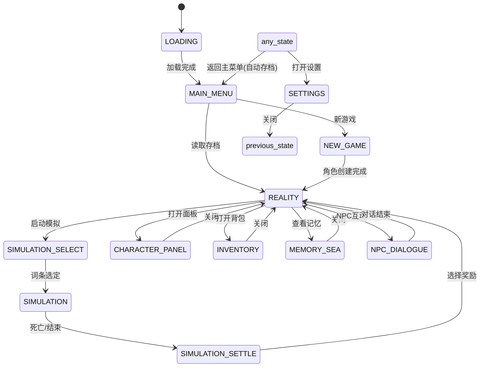
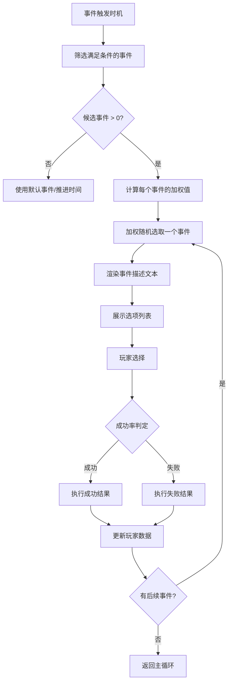
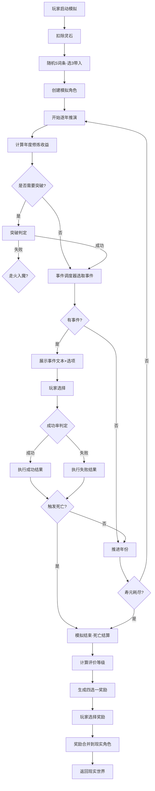
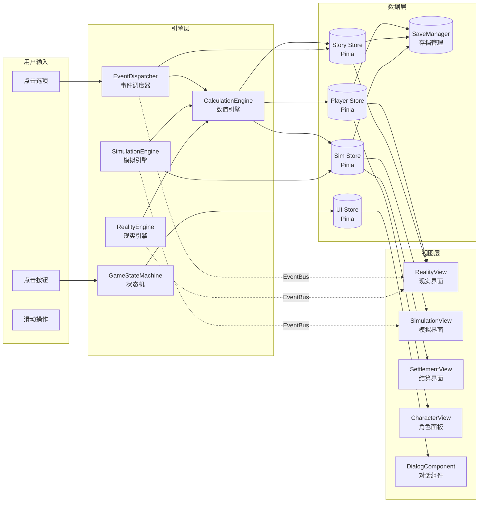

# 《玄衍仙途：命运模拟器》技术架构文档

> **版本**：v1.1（经技术评审修订）  
> **适用阶段**：Demo版（炼气期·外门篇）  
> **技术栈**：Vue 3 + Vite + Pinia + 纯前端H5

---

## 目录

1. [技术选型](#1-技术选型)
2. [核心数据结构设计](#2-核心数据结构设计)（含补充接口定义 2.5）
3. [游戏引擎核心模块](#3-游戏引擎核心模块)（含 3.5 效果叠加/数值安全/精度规范、3.6 Seeded RNG、3.7 数据事务）
4. [存档系统设计](#4-存档系统设计)（含 4.4 容量管理、4.5 中间存档、4.6 迁移、4.7 降级恢复）
5. [模块通信设计](#5-模块通信设计)（含 EventBus 生命周期管理）
6. [文件结构设计](#6-文件结构设计)（含 6.3 路由守卫策略）
7. [性能优化策略](#7-性能优化策略)（含批量更新、动态虚拟列表）
8. [扩展性设计](#8-扩展性设计)（含新增词条类型 Checklist）
9. [开发规范](#9-开发规范)

---

## 1. 技术选型

### 1.1 为什么选择 Vue 3 + 纯前端H5

| 决策因素 | 分析 |
|----------|------|
| **游戏特性** | 文字修仙模拟器，核心是文本叙事+数值计算+状态管理，不涉及3D渲染或高频物理运算 |
| **目标平台** | 手机端竖屏H5（首发微信小游戏/H5），需快速上线验证核心玩法 |
| **团队规模** | 独立开发或小团队，需要高效开发工具和成熟的生态支持 |
| **维护成本** | 纯前端无服务端依赖，部署简单，运营成本极低 |
| **Vue 3 优势** | Composition API 适合复杂游戏状态管理；响应式系统天然适合数值驱动的游戏UI；生态成熟 |

**不选择游戏引擎（如 Phaser/Cocos）的原因**：
- 本游戏核心体验是文字叙事，非实时渲染类游戏
- Vue 组件化开发更适合大量UI界面（模拟界面、结算界面、角色面板等）
- 减少学习成本，降低包体大小，加快首屏加载

### 1.2 项目依赖选择

| 类别 | 选型 | 理由 |
|------|------|------|
| **框架** | Vue 3.4+ | Composition API，性能优秀 |
| **构建工具** | Vite 5+ | 极速HMR，按需编译，构建产物小 |
| **状态管理** | Pinia 2+ | 轻量、支持持久化插件、TypeScript友好 |
| **路由** | Vue Router 4+ | 官方路由，支持路由守卫用于游戏状态拦截 |
| **持久化** | pinia-plugin-persistedstate | 自动将store同步到localStorage |
| **动画** | @vueuse/motion + CSS Animation | 轻量动画库，满足文字游戏所需的过渡效果 |
| **工具库** | lodash-es | 按需引入，用于 debounce/throttle/cloneDeep 等 |
| **文本排版** | 自研组件 | 打字机效果、富文本渲染、选项交互 |
| **图标** | 内联SVG | 减少HTTP请求，自定义修仙风格图标 |
| **音效** | Howler.js | 轻量音频库，支持移动端音频兼容性 |
| **压缩** | lz-string | 存档数据压缩，减少localStorage占用 |

### 1.3 项目结构概览

```
xyxztu/                          # 项目根目录（玄衍仙途）
├── index.html
├── vite.config.ts
├── package.json
├── tsconfig.json
├── public/
│   ├── favicon.ico
│   └── audio/                   # 音效资源
│       ├── bgm/                 # 背景音乐
│       └── sfx/                 # 音效
└── src/
    ├── main.js                  # 入口
    ├── App.vue                  # 根组件
    ├── router/                  # 路由配置
    ├── stores/                  # Pinia状态管理
    ├── engines/                 # 游戏引擎核心
    ├── models/                  # 数据模型（JSDoc类型定义）
    ├── data/                    # 游戏数据JSON
    ├── components/              # Vue组件
    ├── composables/             # 组合式函数
    ├── views/                   # 页面视图
    ├── styles/                  # 全局样式
    └── utils/                   # 工具函数
```

---

## 2. 核心数据结构设计

### 2.1 角色数据模型（Player）

```typescript
/** 六维属性 */
interface Attributes {
  comprehension: number;  // 悟性：影响功法修炼速度、突破成功率、炼丹炼器成功率
  luck: number;           // 气运：影响奇遇概率、危机程度、掉落品质、词条出现概率
  charisma: number;       // 魅力：影响NPC好感度提升速度、交易议价空间
  strength: number;       // 根骨：影响气血上限、炼体功法加成、物理防御
  agility: number;        // 敏捷：影响战斗先手、闪避率、逃跑成功率
  spirit: number;         // 神识：影响模拟器每日次数上限、感知范围、阵法理解
}

/** 资源系统 */
interface Resources {
  spiritStones: number;     // 下品灵石（基础货币，模拟消耗+购买物品）
  spiritStonesMid: number;  // 中品灵石（1中品=100下品，正式版）
  merit: number;            // 功德点（行善积累，兑换正道词条/功法）
  reputation: number;       // 声望值（社会地位指标，解锁购买/任务权限）
  contribution: number;     // 宗门贡献点（宗门内部货币，兑换功法/物品）
}

/** 词条槽位 */
interface Slot {
  id: string;               // 槽位ID（slot_0, slot_1, ...）
  termId: string | null;    // 已装备词条ID，null为空槽位
  locked: boolean;          // 是否锁定
  unlockCondition: string;  // 解锁条件描述（如 "炼气4层"）
}

/** 功法条目 */
interface Technique {
  id: string;               // 功法ID（如 GJ-T01）
  level: number;            // 修炼层数/熟练度（0-100）
  mastery: 'unfamiliar' | 'familiar' | 'proficient' | 'mastered'; // 熟练度阶段
}

/** 背包物品 */
interface InventoryItem {
  itemId: string;           // 物品ID（如 ITM-D01）
  quantity: number;         // 数量
  metadata?: Record<string, any>; // 附加信息（如炼制品质、附加属性）
}

/** NPC关系 */
interface Relationship {
  npcId: string;            // NPC标识
  affinity: number;         // 好感度（-100 ~ 100）
  trust: number;            // 信任度（0 ~ 100）
  level: 'hostile' | 'cold' | 'neutral' | 'friendly' | 'trusted' | 'sworn';
  secrets: string[];        // 已发现的NPC秘密ID列表
  interactionCount: number; // 互动次数
}

/** 玩家完整数据模型 */
interface Player {
  id: string;                 // 玩家唯一ID（存档用）
  name: string;               // 角色名
  age: number;                // 当前年龄

  // ── 境界系统 ──
  realm: string;              // 境界名称（如 "炼气三层"）
  realmLevel: number;         // 境界层级（0-8对应炼气1-9层）
  cultivation: number;        // 当前修为值
  maxCultivation: number;     // 当前层级修为上限

  // ── 战斗属性 ──
  hp: number;                 // 当前气血
  maxHp: number;              // 气血上限
  mp: number;                 // 当前灵力
  maxMp: number;              // 灵力上限

  // ── 六维属性 ──
  attributes: Attributes;

  // ── 灵根 ──
  spiritRoot: {
    type: string[];           // 灵根属性（如 ["金","木","水","火"]）
    quality: number;          // 灵根品质等级（1=废品, 2=伪, 3=真, 4=地, 5=天, 6=变异）
    multiplier: number;       // 修炼倍率（0.3 ~ 6.0）
  };

  // ── 资源 ──
  resources: Resources;

  // ── 词条系统 ──
  slots: Slot[];              // 词条槽位列表（最多9个）
  unlockedSlots: number;      // 已解锁槽位数
  collectedTerms: string[];   // 已收集的所有词条ID（含未装备的）
  activeSynergies: string[];  // 当前激活的组合效果ID列表

  // ── 功法 ──
  techniques: Technique[];    // 已学功法列表
  activeTechnique: string | null; // 当前主修功法ID

  // ── 背包 ──
  inventory: InventoryItem[];

  // ── NPC关系 ──
  relationships: Record<string, Relationship>; // key为npcId

  // ── 记忆碎片 ──
  memoryFragments: MemoryFragment[];

  // ── 状态标记 ──
  flags: Record<string, boolean | number | string>;
  // 常用flags示例：
  // "personality": "hidden" | "ambitious" | "calm"  —— 性格标签
  // "chapter": 1  —— 当前章节
  // "sim_unlocked": true  —— 是否解锁模拟器
  // "first_sim_done": true  —— 是否完成首次模拟
  // "liufei_betrayed": true  —— 柳飞是否已背叛
  // "total_damage_taken": 1234  —— 累计受伤（词条升级用）

  // ── 成就 ──
  achievements: Achievement[];

  // ── 统计 ──
  stats: {
    totalSimulations: number;   // 总模拟次数
    totalDeaths: number;        // 总死亡次数
    deathCauses: Record<string, number>; // 各死因统计
    longestLife: number;        // 最长寿命（模拟中）
    totalChoicesMade: number;   // 总选择次数
  };

  // ── 存档元信息 ──
  createdAt: number;            // 创建时间戳
  updatedAt: number;            // 最后更新时间戳
  playTime: number;             // 总游玩时长（秒）
  version: string;              // 存档版本号
}
```

### 2.2 词条数据模型（Term）

```typescript
/** 词条品质枚举 */
type TermRarity = 'common' | 'rare' | 'epic' | 'legendary' | 'cursed';
// 对应颜色：白 / 蓝 / 紫 / 金 / 灰（凶品）

/** 词条类型枚举 */
type TermCategory = 'attribute' | 'physique' | 'skill' | 'fortune' | 'background' | 'special';
// 属性型 / 体质型 / 技艺型 / 运道型 / 背景型 / 特殊型

/** 效果类型 */
type EffectType = 
  | 'flat_add'        // 固定值加法（如 悟性+2）
  | 'percent_add'     // 百分比加成（如 气血上限+10%）
  | 'trigger'         // 条件触发（如 致命时10%概率保命）
  | 'passive'         // 被动光环（如 炼丹成功率+15%）
  | 'condition_mod'   // 条件修正（如 炼气5层后修炼速度+25%）
  | 'event_unlock';   // 解锁事件选项（如 解锁隐藏对话）

/** 词条效果 */
interface TermEffect {
  type: EffectType;
  target: string;         // 作用目标（属性名/系统标识）
  value: number;          // 效果数值
  condition?: string;     // 触发条件表达式（如 "realmLevel >= 4"）
  triggerChance?: number; // 触发概率（0-1）
  duration?: string;      // 持续时间（"permanent" | "combat" | "3turns"）
}

/** 词条完整定义（数据表驱动，只读） */
interface TermDefinition {
  id: string;                   // 词条ID（如 TRT-W01）
  name: string;                 // 词条名称
  rarity: TermRarity;           // 品质
  category: TermCategory;       // 类型
  description: string;          // 文字描述（给玩家看的）
  effects: TermEffect[];        // 效果列表
  conflicts: string[];          // 冲突词条ID列表（互斥）
  upgradeTo: string | null;     // 升级后词条ID（null=不可升级）
  upgradeCondition: string | null; // 升级条件表达式
  source: string;               // 获取途径描述
  tags: string[];               // 标签（用于组合检测，如 ["sword", "mind"]）
}

/** 词条组合效果定义 */
interface SynergyDefinition {
  id: string;              // 组合ID（如 SYN-01）
  name: string;            // 组合名称
  requiredTerms: string[]; // 所需词条ID列表
  description: string;     // 描述
  effects: TermEffect[];   // 组合效果
  unlockEvent?: string;    // 触发隐藏事件的ID
}

/** 槽位运行时状态 */
interface SlotState {
  index: number;           // 槽位序号（0-8）
  termId: string | null;   // 已装备词条ID
  locked: boolean;         // 是否锁定
}
```

**组合效果检测算法伪代码：**

```typescript
/**
 * 检测当前装备的词条是否激活了组合效果
 * @param equippedTerms 当前装备的词条ID列表
 * @param allSynergies 所有组合定义
 * @returns 激活的组合ID列表
 */
function detectSynergies(
  equippedTerms: string[], 
  allSynergies: SynergyDefinition[]
): string[] {
  const active: string[] = [];
  
  for (const synergy of allSynergies) {
    // 检查所需词条是否全部装备
    const allPresent = synergy.requiredTerms.every(
      termId => equippedTerms.includes(termId)
    );
    if (allPresent) {
      active.push(synergy.id);
    }
  }
  
  return active;
}
```

**词条冲突检测边界说明：**

> 以下边界情况需特别注意：
> 1. **事件直接获得词条**：通过 `OptionResult.termsGained` 获得的词条先进入"待装备"状态（加入 `collectedTerms`），不自动装备，需玩家在角色面板手动装备时才触发冲突检查
> 2. **组合效果取消**：每次装备变更后（装备/卸下/升级）都必须重新执行 `detectSynergies()` 并更新 `activeSynergies`，已取消的组合效果其对应的属性加成也需同步移除
> 3. **词条升级产生新冲突**：升级后需重新检查冲突表，如果升级后的词条与已装备的其他词条冲突，提示玩家选择保留方案
> 4. **统一入口**：所有装备操作必须通过 `equipTerm(slotIndex, termId)` 入口，禁止直接修改 `slots` 数组

### 2.3 事件数据模型（Event）

```typescript
/** 事件触发场景 */
type EventScene = 'simulation' | 'reality' | 'both';

/** 事件分类 */
type EventCategory = 'cultivation' | 'adventure' | 'combat' | 'social' | 'disaster';

/** 条件判断节点 */
interface Condition {
  // 支持的条件类型
  type: 
    | 'attribute_check'    // 属性判定（如 悟性>=40）
    | 'item_check'         // 物品检查（如 持有清心丹）
    | 'flag_check'         // 标记检查（如 chapter >= 2）
    | 'relationship_check' // 关系检查（如 陈墨好感>=友善）
    | 'random_check'       // 随机判定（如 30%概率）
    | 'term_check'         // 词条检查（如 装备了剑道入门）
    | 'memory_check'       // 记忆碎片检查（如 持有某记忆碎片）
    | 'compound';          // 复合条件（AND/OR组合）
  
  field: string;           // 检查字段路径（如 "attributes.comprehension"）
  operator: '>=' | '<=' | '==' | '!=' | '>' | '<' | 'contains' | 'not_contains';
  value: any;              // 比较值
  
  // compound类型专用
  children?: Condition[];
  logic?: 'AND' | 'OR';
}

/** 事件选项的结果 */
interface OptionResult {
  // 属性变化
  attributeChanges?: Partial<Record<keyof Attributes, number>>;
  hpChange?: number;
  mpChange?: number;
  cultivationChange?: number;  // 可以是百分比字符串如 "15%" 或固定值
  
  // 资源变化
  resourceChanges?: Partial<Resources>;
  
  // 物品变化
  itemsGained?: Array<{ itemId: string; quantity: number }>;
  itemsLost?: Array<{ itemId: string; quantity: number }>;
  
  // 功法变化
  techniquesGained?: string[];  // 功法ID列表
  
  // 词条变化
  termsGained?: string[];
  
  // 关系变化
  relationshipChanges?: Array<{ npcId: string; affinity: number; trust?: number }>;
  
  // 标记设置
  setFlags?: Record<string, boolean | number | string>;
  
  // 记忆碎片
  memoryFragmentGained?: string;  // 记忆碎片ID
  
  // 导航
  nextEvent?: string;        // 跳转到的下一个事件ID
  triggerDeath?: boolean;    // 是否触发死亡
  deathCause?: string;       // 死因描述
  triggerAchievement?: string; // 触发成就
  
  // 文本
  resultText: string;        // 结果描述文本
  
  // 成功/失败分支
  successNext?: string;      // 成功时跳转事件
  failureNext?: string;      // 失败时跳转事件
}

/** 事件选项 */
interface EventOption {
  id: string;                // 选项标识（A/B/C/D）
  text: string;              // 选项文本
  description?: string;      // 补充说明
  
  // 显示条件（不满足则隐藏该选项）
  visibleCondition?: Condition;
  
  // 是否可用（不满足则灰显但可见，显示原因）
  enabledCondition?: Condition;
  disabledReason?: string;   // 不可用时的提示文案
  
  // 选择后的结果
  successRate?: number;      // 成功率（0-1），无则默认100%
  successResult: OptionResult;
  failureResult?: OptionResult; // 成功率<1时必填
  
  // 特殊标记
  isMemoryHint?: boolean;    // 是否是记忆碎片提示选项（高亮显示）
  requiresItem?: string;     // 需要消耗的物品ID
}

/** 事件完整定义（数据表驱动，只读） */
interface EventDefinition {
  id: string;                  // 事件ID（如 EVT-T01）
  name: string;                // 事件名称
  category: EventCategory;     // 分类
  scene: EventScene;           // 触发场景
  
  // 触发条件
  triggerConditions: Condition[];  // 所有条件都满足才触发（AND）
  
  // 触发权重
  weight: number;              // 基础权重（1-100）
  weightModifiers?: Array<{    // 权重修正
    condition: Condition;
    multiplier: number;        // 乘数（如 气运高时权重x2）
  }>;
  
  // 事件内容
  description: string;         // 事件描述文本（支持模板变量如 {playerName}）
  options: EventOption[];      // 选项列表
  
  // 事件链
  prerequisiteEvents?: string[];  // 前置事件ID（必须发生过）
  followUpEvents?: string[];      // 后续可能事件ID列表
  cooldown?: number;              // 冷却时间（年/次）
  maxTriggerCount?: number;       // 最大触发次数（null=无限）
  
  // 特殊标记
  isUnique?: boolean;           // 是否一次性事件
  isHidden?: boolean;           // 是否隐藏事件
  isMainStory?: boolean;        // 是否主线事件
  chapter?: number;             // 所属章节（主线事件专用）
  
  // 记忆碎片关联
  relatedMemoryFragment?: string; // 关联的记忆碎片ID
}
```

**条件判断引擎伪代码：**

```typescript
/**
 * 评估条件是否满足
 * @param condition 条件定义
 * @param player 玩家数据
 * @param context 当前上下文（模拟/现实状态）
 * @returns boolean
 */
function evaluateCondition(
  condition: Condition, 
  player: Player,
  context: GameContext
): boolean {
  switch (condition.type) {
    case 'attribute_check': {
      const value = getNestedValue(player, condition.field);
      return compare(value, condition.operator, condition.value);
    }
    case 'item_check': {
      return player.inventory.some(
        item => item.itemId === condition.value && item.quantity > 0
      );
    }
    case 'flag_check': {
      const flagValue = player.flags[condition.field] ?? 
                        context.flags[condition.field];
      return compare(flagValue, condition.operator, condition.value);
    }
    case 'random_check': {
      return Math.random() < condition.value;
    }
    case 'term_check': {
      return player.slots.some(
        s => s.termId === condition.value && !s.locked
      );
    }
    case 'compound': {
      if (condition.logic === 'AND') {
        return condition.children!.every(c => evaluateCondition(c, player, context));
      } else {
        return condition.children!.some(c => evaluateCondition(c, player, context));
      }
    }
    // ...其他类型
  }
}
```

### 2.4 存档数据模型（SaveData）

```typescript
/** 单个存档槽位 */
interface SaveSlot {
  id: number;                  // 槽位编号（0-3）
  isEmpty: boolean;            // 是否为空
  player: Player | null;       // 玩家数据
  storyState: StoryState;      // 剧情状态
  simulationHistory: SimRecord[]; // 模拟历史记录（最近5次）
  meta: SaveMeta;              // 存档元信息
}

/** 剧情状态 */
interface StoryState {
  currentChapter: number;        // 当前章节（1-5）
  currentNodeId: string;         // 当前剧情节点ID
  completedNodes: string[];      // 已完成节点列表
  choicesMade: Record<string, string>; // 各节点的选择记录（nodeId -> optionId）
  butterflyLevel: number;        // 蝴蝶效应偏移等级（0-3）
  pendingEvents: string[];       // 待触发事件队列
  activeQuests: Quest[];         // 进行中的任务
}

/** 模拟历史记录 */
interface SimRecord {
  simId: string;               // 模拟ID
  startYear: number;           // 起始年份
  endYear: number;             // 结束年份（死亡年）
  deathCause: string;          // 死因
  rating: 'D' | 'C' | 'B' | 'A' | 'S'; // 评价等级
  rewardChosen: string;        // 选择的奖励类型（term/cultivation/technique/memory）
  rewardId: string;            // 奖励具体ID
  duration: number;            // 模拟耗时（秒）
  eventCount: number;          // 经历事件数
}

/** 存档元信息 */
interface SaveMeta {
  saveTime: number;            // 存档时间戳
  version: string;             // 游戏版本号
  playTime: number;            // 总游玩时长
  playerName: string;          // 角色名
  realm: string;               // 当前境界
  chapter: number;             // 当前章节
  autoSave: boolean;           // 是否自动存档
  checksum: string;            // 数据校验码
}

/** 完整存档数据 */
interface SaveData {
  slots: [SaveSlot, SaveSlot, SaveSlot, SaveSlot]; // 3个自动 + 1个手动
  settings: GameSettings;      // 全局设置（不随存档变化）
  globalFlags: Record<string, any>; // 全局标记（跨存档共享，如成就）
  schemaVersion: number;       // 存档结构版本号（用于迁移）
}

/** 游戏设置 */
interface GameSettings {
  textSpeed: 'slow' | 'normal' | 'fast' | 'instant'; // 文字显示速度
  bgmVolume: number;           // 背景音乐音量（0-1）
  sfxVolume: number;           // 音效音量（0-1）
  vibration: boolean;          // 震动开关
  autoSave: boolean;           // 自动存档开关
  theme: 'dark' | 'light';    // 主题
}
```

**存档槽位设计：**

| 槽位 | 类型 | 触发时机 | 说明 |
|------|------|----------|------|
| Slot 0 | 自动存档 | 每次关键选择后 | 始终保存最新进度 |
| Slot 1 | 章节存档 | 进入新章节时 | 章节入口备份 |
| Slot 2 | 预模拟存档 | 启动模拟前 | 模拟前自动备份 |
| Slot 3 | 手动存档 | 玩家主动操作 | 玩家自定义存档点 |

### 2.5 补充接口定义

以下接口在存档模型和引擎中被引用，此处统一定义。

```typescript
/** 记忆碎片 */
interface MemoryFragment {
  id: string;                      // 碎片ID（如 MEM-001）
  type: 'danger_warning' | 'opportunity' | 'technique' | 'npc_intel' | 'recipe' | 'world_truth';
  name: string;                    // 碎片名称
  description: string;             // 碎片描述文本
  relatedEventId: string;          // 关联的事件ID
  hintText: string;                // 现实匹配时的提示文本
  recommendedOption?: string;      // 推荐的选项ID
  acquiredYear: number;            // 获取时的模拟年份
  source: string;                  // 获取来源（哪次模拟、哪个事件）
}

/** 任务 */
interface Quest {
  id: string;                      // 任务ID
  name: string;                    // 任务名称
  description: string;             // 任务描述
  type: 'main' | 'side' | 'daily'; // 任务类型
  objectives: Array<{
    type: 'kill' | 'collect' | 'talk' | 'reach' | 'trigger_event';
    target: string;                // 目标ID
    current: number;               // 当前进度
    required: number;              // 目标数量
  }>;
  rewards: {
    spiritStones?: number;
    contribution?: number;
    items?: Array<{ itemId: string; quantity: number }>;
    terms?: string[];
  };
  status: 'active' | 'completed' | 'failed' | 'expired';
  deadline?: number;               // 截止时间（游戏日），无则不限时
}

/** 成就 */
interface Achievement {
  id: string;                      // 成就ID（如 ACH-001）
  name: string;                    // 成就名称
  description: string;             // 成就描述
  category: 'cultivation' | 'simulation' | 'collection' | 'story' | 'hidden';
  condition: {
    type: string;                  // 达成条件类型
    target: number;                // 达成阈值
    current: number;               // 当前进度
  };
  reward: {
    spiritStones?: number;
    terms?: string[];              // 解锁词条ID
    title?: string;                // 限定称号
    memoryFragment?: string;       // 记忆碎片ID
  };
  unlocked: boolean;
  unlockedAt?: number;             // 解锁时间戳
}

/** 游戏上下文（引擎运行时使用） */
interface GameContext {
  player: Player;                  // 当前玩家数据
  currentScene: 'simulation' | 'reality'; // 当前场景
  currentYear: number;             // 当前游戏年份
  currentDay: number;              // 当前游戏日
  completedEvents: string[];       // 已完成事件ID列表
  flags: Record<string, any>;      // 上下文标记
  rng: SeededRandom;               // 种子随机数生成器（见3.6节）
  location?: string;               // 当前位置
  butterflyLevel: number;          // 蝴蝶效应等级
}

/** 模拟运行时状态 */
interface SimulationState {
  simId: string;
  startYear: number;
  currentYear: number;
  maxYear: number;
  character: Player;               // 模拟中角色状态（独立于现实角色）
  simTerms: string[];              // 本次模拟选中的词条ID
  eventLog: Array<{
    year: number;
    eventId: string;
    optionId: string;
    success: boolean;
    resultText: string;
  }>;
  savePoints: Array<{
    year: number;
    characterSnapshot: Player;     // 该年的角色数据快照
  }>;
  status: 'running' | 'paused' | 'ended';
  speed: 'normal' | 'fast' | 'instant';
  butterflyOffset: number;         // 蝴蝶效应偏移量
  seed: string;                    // 本次模拟的随机种子（用于Bug复现）
}

/** 战斗属性（战斗计算用） */
interface CombatStats {
  attack: number;
  defense: number;
  hp: number;
  maxHp: number;
  element: string;
  critRate: number;               // 暴击率（0-1）
  critDamage: number;             // 暴击伤害倍率（如 1.5 = 150%）
  buffAttack: number;             // 攻击buff加成（0-1）
  buffDefense: number;            // 防御buff加成（0-1）
  agility: number;                // 敏捷（决定先手）
}

/** 伤害结果 */
interface DamageResult {
  damage: number;
  isCrit: boolean;
  elementMultiplier: number;
  isKill: boolean;
}

/** 奖励候选 */
interface RewardCandidate {
  type: 'term' | 'cultivation' | 'technique' | 'memory';
  data: any;
  quality?: TermRarity;
  description?: string;
}
```

---

## 3. 游戏引擎核心模块

### 3.1 状态机（GameStateMachine）

```typescript
/** 游戏状态枚举 */
enum GameState {
  LOADING = 'loading',           // 加载中
  MAIN_MENU = 'main_menu',       // 主菜单
  NEW_GAME = 'new_game',         // 新建角色
  REALITY = 'reality',           // 现实世界（主线推进）
  SIMULATION_SELECT = 'sim_select', // 模拟准备（选词条）
  SIMULATION = 'simulation',     // 模拟进行中
  SIMULATION_SETTLE = 'sim_settle', // 模拟结算
  CHARACTER_PANEL = 'character', // 角色面板
  INVENTORY = 'inventory',       // 背包界面
  MEMORY_SEA = 'memory_sea',     // 记忆之海
  NPC_DIALOGUE = 'npc_dialogue', // NPC对话
  SETTINGS = 'settings',         // 设置界面
  ACHIEVEMENT = 'achievement',   // 成就界面
}

/** 状态转换规则定义 */
interface StateTransition {
  from: GameState | '*';    // 源状态（*表示任意状态）
  to: GameState;
  guard?: () => boolean;    // 转换守卫（返回false则阻止转换）
  onEnter?: () => void;     // 进入目标状态时执行
  onExit?: () => void;      // 离开源状态时执行
}
```

**状态转换流程图：**



**关键设计原则：**
- 进入 `SIMULATION` 前自动保存当前状态到 Slot 2（预模拟存档）
- 每次 `REALITY` 中的关键选择后自动保存到 Slot 0
- 从任意状态返回主菜单前强制执行 `autoSave()`
- `SIMULATION_SETTLE` → `REALITY` 转换时合并奖励数据
- **previousState 机制**：状态机维护 `previousState: GameState | null` 字段，每次进入 `SETTINGS` 前自动记录当前状态，从 `SETTINGS` 返回时恢复到 `previousState`，避免模拟中打开设置后状态丢失

```typescript
class GameStateMachine {
  private currentState: GameState = GameState.LOADING;
  private previousState: GameState | null = null;  // 记录前驱状态
  private transitions: StateTransition[];
  
  /**
   * 进入设置界面时，自动记录当前状态
   */
  openSettings(): void {
    if (this.currentState !== GameState.SETTINGS) {
      this.previousState = this.currentState;
      this.transition(GameState.SETTINGS);
    }
  }
  
  /**
   * 关闭设置，返回之前的状态
   */
  closeSettings(): void {
    if (this.currentState === GameState.SETTINGS && this.previousState) {
      const target = this.previousState;
      this.previousState = null;
      this.transition(target);
    }
  }
}
```

> **边界处理**：如果 `previousState` 为 `null`（从主菜单直接进设置），关闭设置时回到 `MAIN_MENU`。模拟进行中（`SIMULATION`）打开设置时，设置界面提供"放弃模拟"选项，而非直接返回。

### 3.2 事件调度器（EventDispatcher）

事件调度器负责根据当前游戏状态，从事件库中筛选、加权、选取下一个要触发的事件。

```typescript
class EventDispatcher {
  private eventPool: EventDefinition[];  // 事件库
  private cooldowns: Map<string, number>; // 事件冷却表
  private triggerCounts: Map<string, number>; // 事件触发计数
  
  /**
   * 从事件库中选取下一个事件
   * @param context 当前游戏上下文
   * @param category 期望的事件分类（可选）
   * @returns 选中的事件定义
   */
  selectNextEvent(context: GameContext, category?: EventCategory): EventDefinition | null {
    // Step 1: 筛选所有满足触发条件的事件
    const candidates = this.eventPool.filter(event => {
      // 场景匹配
      if (event.scene !== 'both' && event.scene !== context.currentScene) return false;
      // 分类过滤
      if (category && event.category !== category) return false;
      // 冷却检查
      if (this.isInCooldown(event.id, context.currentYear)) return false;
      // 触发次数检查
      if (event.maxTriggerCount && this.getTriggerCount(event.id) >= event.maxTriggerCount) return false;
      // 前置事件检查
      if (event.prerequisiteEvents?.some(eid => !context.completedEvents.includes(eid))) return false;
      // 条件判定
      return event.triggerConditions.every(c => evaluateCondition(c, context.player, context));
    });
    
    if (candidates.length === 0) return null;
    
    // Step 2: 计算加权概率
    const weights = candidates.map(event => this.calculateWeight(event, context));
    
    // Step 3: 加权随机选取
    return weightedRandom(candidates, weights);
  }
  
  /**
   * 计算事件最终权重
   */
  private calculateWeight(event: EventDefinition, context: GameContext): number {
    let weight = event.weight;
    
    // 应用权重修正
    if (event.weightModifiers) {
      for (const mod of event.weightModifiers) {
        if (evaluateCondition(mod.condition, context.player, context)) {
          weight *= mod.multiplier;
        }
      }
    }
    
    // 气运影响：气运越高，奇遇/好事权重越高
    if (['adventure'].includes(event.category)) {
      weight *= 1 + context.player.attributes.luck * 0.005;
    }
    
    // 词条影响
    for (const slot of context.player.slots) {
      if (slot.termId) {
        const term = getTermDefinition(slot.termId);
        // 词条中可能有事件权重修正
        const eventMod = term.effects.find(
          e => e.type === 'passive' && e.target === `event_weight:${event.category}`
        );
        if (eventMod) weight *= (1 + eventMod.value);
      }
    }
    
    return Math.max(weight, 0.1); // 最低权重保底
  }
}
```

**事件触发流程图：**



### 3.3 模拟系统引擎（SimulationEngine）

```typescript
class SimulationEngine {
  private dispatcher: EventDispatcher;
  private simState: SimulationState | null = null;
  
  /**
   * 启动一次模拟
   */
  startSimulation(config: SimConfig): SimulationState {
    // 1. 扣除灵石
    // 2. 随机抽取5个候选词条，玩家选3个
    // 3. 创建模拟角色（基于现实角色+模拟词条）
    // 4. 初始化模拟状态
    this.simState = {
      simId: generateId(),
      startYear: config.player.age,
      currentYear: config.player.age,
      maxYear: this.calculateMaxYear(config.player), // 基于境界计算
      character: this.createSimCharacter(config.player, config.terms),
      simTerms: config.terms,
      eventLog: [],
      savePoints: [],
      status: 'running',
      speed: config.speed || 'normal',
      butterflyOffset: 0, // 蝴蝶效应偏移量
    };
    
    return this.simState;
  }
  
  /**
   * 推进一年（模拟主循环的一步）
   */
  advanceYear(): YearResult {
    if (!this.simState || this.simState.status !== 'running') {
      throw new Error('Simulation not running');
    }
    
    const year = this.simState.currentYear;
    const events: EventResult[] = [];
    
    // 1. 基础修炼推进（每年自动增加修为）
    const cultivationGain = this.calculateYearlyCultivation(this.simState.character);
    this.simState.character.cultivation += cultivationGain;
    
    // 2. 检查是否有境界突破
    if (this.simState.character.cultivation >= this.simState.character.maxCultivation) {
      const breakthroughResult = this.attemptBreakthrough();
      events.push(breakthroughResult);
    }
    
    // 3. 根据年份推进节奏生成事件
    //    每年1-3个事件，由事件调度器决定
    const eventCount = this.calculateEventCount(year);
    for (let i = 0; i < eventCount; i++) {
      const event = this.dispatcher.selectNextEvent(this.getSimContext(), undefined);
      if (event) {
        events.push({ eventId: event.id, category: event.category });
        // 事件结果会在玩家选择后处理
        return { year, events, pendingEvent: event };
      }
    }
    
    // 4. 年龄增长 & 寿元检查
    this.simState.currentYear++;
    if (this.checkDeathByAge()) {
      return this.endSimulation('寿元耗尽');
    }
    
    return { year, events, pendingEvent: null };
  }
  
  /**
   * 处理玩家对事件的选择
   */
  handleChoice(eventId: string, optionId: string): ChoiceResult {
    const event = getEventDefinition(eventId);
    const option = event.options.find(o => o.id === optionId);
    
    // 成功率判定
    let success = true;
    if (option.successRate !== undefined && option.successRate < 1) {
      // 词条效果可能修正成功率
      const modifiedRate = this.applyRateModifiers(option.successRate);
      success = Math.random() < modifiedRate;
    }
    
    const result = success ? option.successResult : (option.failureResult || option.successResult);
    
    // 执行结果：更新模拟角色数据
    this.applyResult(result);
    
    // 记录到事件日志
    this.simState!.eventLog.push({
      year: this.simState!.currentYear,
      eventId,
      optionId,
      success,
      resultText: result.resultText,
    });
    
    // 检查死亡标记
    if (result.triggerDeath) {
      return { ...result, simulationEnded: true, deathCause: result.deathCause };
    }
    
    return { ...result, simulationEnded: false };
  }
  
  /**
   * 模拟结束，生成结算数据
   */
  settleSimulation(deathCause?: string): SimulationSettlement {
    const state = this.simState!;
    state.status = 'ended';
    
    // 1. 计算评价等级
    const rating = this.calculateRating(state);
    
    // 2. 生成四个候选奖励
    const rewards = this.generateRewards(state, rating);
    
    // 3. 提取记忆碎片（基于经历的事件）
    const memories = this.extractMemoryFragments(state);
    
    return {
      simId: state.simId,
      rating,
      yearsLived: state.currentYear - state.startYear,
      deathCause,
      rewards,          // 四选一候选
      memories,         // 可能获得的记忆碎片
      eventLog: state.eventLog,
    };
  }
  
  /**
   * 生成四选一奖励
   * 从四类奖励中各生成一个候选：词条/修为/功法/记忆碎片
   */
  private generateRewards(
    state: SimulationState, 
    rating: string
  ): RewardCandidate[] {
    const rewards: RewardCandidate[] = [];
    
    // 词条候选：根据评价等级和氣运生成
    rewards.push({
      type: 'term',
      data: this.generateTermCandidate(rating, state.character.attributes.luck)
    });
    
    // 修为候选：基于模拟中的最高修为
    rewards.push({
      type: 'cultivation',
      data: { amount: state.character.cultivation * 0.1 } // 带回10%修为
    });
    
    // 功法候选：模拟中学过的功法
    const learnedTech = state.character.techniques.length > 0
      ? state.character.techniques[state.character.techniques.length - 1]
      : null;
    rewards.push({
      type: 'technique',
      data: learnedTech
    });
    
    // 记忆碎片候选
    rewards.push({
      type: 'memory',
      data: this.selectMemoryFragment(state)
    });
    
    return rewards;
  }
}
```

**模拟流程图：**



### 3.4 现实系统引擎（RealityEngine）

```typescript
class RealityEngine {
  private dispatcher: EventDispatcher;
  private storyEngine: StoryEngine;
  
  /**
   * 现实世界时间推进（一个游戏日）
   */
  advanceDay(): DayResult {
    const result: DayResult = { events: [], notifications: [] };
    
    // 1. 每日自动修炼（基于主修功法和灵根倍率）
    const dailyCultivation = this.calculateDailyCultivation();
    player.cultivation += dailyCultivation;
    
    // 2. 检查突破
    if (player.cultivation >= player.maxCultivation) {
      result.events.push({ type: 'breakthrough_available' });
    }
    
    // 3. 日常资源结算（灵石月例等）
    this.processDailyResources();
    
    // 4. 突发事件检测（受气运影响）
    const randomEventChance = 0.05 + player.attributes.luck * 0.002;
    if (Math.random() < randomEventChance) {
      const event = this.dispatcher.selectNextEvent(this.getRealityContext(), undefined);
      if (event) {
        result.events.push({ type: 'random_event', event });
      }
    }
    
    // 5. 主线剧情推进检查
    const storyEvent = this.storyEngine.checkProgress();
    if (storyEvent) {
      result.events.push({ type: 'story_event', event: storyEvent });
    }
    
    // 6. 蝴蝶效应处理
    this.processButterflyEffects();
    
    return result;
  }
  
  /**
   * 蝴蝶效应处理
   * 根据模拟带回的记忆碎片和玩家行为，偏移现实事件
   */
  private processButterflyEffects(): void {
    const butterflyLevel = storyState.butterflyLevel;
    
    // 蝴蝶效应层级效果
    switch (butterflyLevel) {
      case 0: // 无偏移
        break;
      case 1: // 微扰：细节变化，大方向不变
        // 事件中NPC的行为时间/方式微调
        this.applyMinorDeviations();
        break;
      case 2: // 偏转：事件形式改变，本质危机仍在
        // 替换部分事件为变体版本
        this.applyMajorDeviations();
        break;
      case 3: // 分流/重塑：重大事件走向改变
        // 解锁全新的剧情分支
        this.applyBranchChanges();
        break;
    }
  }
  
  /**
   * 微扰实现：通过事件变体表替换细节
   */
  private applyMinorDeviations(): void {
    // 实现约束：不使用动态生成，而是通过策划预定义的变体表
    // 变体表格式：{ eventId: string, variantId: string, condition: Condition }
    // 例：EVT-S01 在蝴蝶效应等级1时，NPC的攻击时间从"深夜"变为"黄昏"
  }
  
  /**
   * 记忆碎片与现实事件匹配
   * 当现实事件触发时，检查玩家是否持有相关记忆碎片
   */
  checkMemoryHints(currentEvent: EventDefinition): MemoryHint[] {
    const hints: MemoryHint[] = [];
    
    for (const fragment of player.memoryFragments) {
      if (fragment.relatedEventId === currentEvent.id) {
        hints.push({
          fragmentId: fragment.id,
          hintText: fragment.hintText,
          highlightedOption: fragment.recommendedOption,
        });
      }
    }
    
    return hints;
  }
}
```

**蝴蝶效应实现约束（Demo版）：**

> **重要**：蝴蝶效应不能动态生成无限种变体（会导致复杂度指数爆炸）。Demo 版采用**策划预定义变体表**方案：

| 约束 | 说明 |
|------|------|
| **Demo 版只实现 Level 0-1** | Level 0=无偏移，Level 1=微扰。Level 2-3 留待正式版 |
| **变体由策划预定义** | 每个受影响的关键事件预定义 1-2 个变体版本，而非动态生成 |
| **变体表驱动** | 数据格式：`{ eventId, variantId, condition, overrides }` |
| **等级提升由主线触发** | butterflyLevel 只通过特定主线事件提升，不自动累积 |
| **影响范围可控** | Level 1 最多影响 5-10 个事件的细节（时间、NPC态度、文本描述） |

```typescript
/** 事件变体表（策划配置） */
interface EventVariant {
  baseEventId: string;          // 原始事件ID
  variantId: string;            // 变体事件ID
  requiredButterflyLevel: number; // 需要的最低蝴蝶效应等级
  condition?: Condition;        // 额外触发条件
  overrides: {
    description?: string;       // 替换描述文本
    weightModifier?: number;    // 权重修正
    optionChanges?: Array<{     // 选项变化
      optionId: string;
      text?: string;            // 替换选项文本
      visibleCondition?: Condition;
    }>;
  };
}

// 示例：
// 原始事件 EVT-S01："深夜，柳飞在练武场拦住你的去路..."
// 变体 EVT-S01-V1（蝴蝶效应Level 1）："黄昏时分，柳飞在丹房外偶遇你..."
// 差异：时间从深夜变黄昏，地点从练武场变丹房，但冲突本质不变
```

### 3.5 数值计算引擎（CalculationEngine）

```typescript
/**
 * 数值计算引擎 - 集中管理所有游戏数值公式
 * 所有公式均为纯函数，便于测试和调参
 */
class CalculationEngine {
  
  // ── 修炼速度计算 ──
  
  /**
   * 每日修为增长量
   */
  static dailyCultivation(player: Player): number {
    const baseRate = 10; // 基础修炼速度
    const rootMultiplier = player.spiritRoot.multiplier; // 灵根倍率
    const techniqueMultiplier = player.activeTechnique 
      ? getTechniqueDefinition(player.activeTechnique).cultivationSpeed 
      : 1.0;
    
    // 词条加成
    const termBonus = CalculationEngine.collectTermBonus(player, 'cultivation_speed');
    
    // 环境因素（灵气浓度）
    const environmentBonus = player.flags['qi_density'] === 'rich' ? 1.3 
      : player.flags['qi_density'] === 'depleted' ? 0.7 
      : 1.0;
    
    return baseRate * rootMultiplier * techniqueMultiplier * (1 + termBonus) * environmentBonus;
  }
  
  // ── 突破概率计算 ──
  
  /**
   * 小境界突破成功率
   * @param player 玩家数据
   * @param useItem 是否使用突破丹
   */
  static breakthroughRate(player: Player, useItem: boolean = false): number {
    // 基础成功率：随层级递减
    const baseRates = [0.95, 0.90, 0.80, 0.70, 0.60, 0.50, 0.40, 0.30, 0.20];
    const base = baseRates[player.realmLevel] ?? 0.5;
    
    // 悟性加成
    const comprehensionBonus = player.attributes.comprehension * 0.005;
    
    // 词条加成
    const termBonus = CalculationEngine.collectTermBonus(player, 'breakthrough_rate');
    
    // 丹药加成
    const itemBonus = useItem ? 0.20 : 0;
    
    // 属性制约：修为过高+悟性过低 → 心魔劫难度增加
    let demonPenalty = 0;
    if (player.attributes.comprehension < 20 && player.realmLevel >= 5) {
      demonPenalty = -0.15;
    }
    
    return Math.min(
      Math.max(base + comprehensionBonus + termBonus + itemBonus + demonPenalty, 0.05),
      0.99
    );
  }
  
  // ── 战斗伤害计算 ──
  
  /**
   * 伤害计算公式
   */
  static calculateDamage(
    attacker: CombatStats, 
    defender: CombatStats,
    skill: TechniqueDefinition | null
  ): DamageResult {
    // 基础攻击力
    const atk = attacker.attack * (1 + attacker.buffAttack);
    
    // 技能加成
    const skillMultiplier = skill ? skill.damageMultiplier : 1.0;
    const skillDamage = skill ? skill.baseDamage : 0;
    
    // 防御减算
    const def = defender.defense * (1 + defender.buffDefense);
    const reduction = def / (def + 100); // 防御公式：def/(def+100)，100防御=50%减伤
    
    // 属性克制
    const elementMultiplier = CalculationEngine.getElementMultiplier(
      skill?.element, defender.element
    );
    
    // 最终伤害
    const rawDamage = (skillDamage + atk * skillMultiplier) * elementMultiplier;
    const finalDamage = Math.max(Math.floor(rawDamage * (1 - reduction)), 1);
    
    // 暴击判定
    const isCrit = Math.random() < attacker.critRate;
    const critDamage = isCrit ? Math.floor(finalDamage * attacker.critDamage) : finalDamage;
    
    return {
      damage: critDamage,
      isCrit,
      elementMultiplier,
      isKill: critDamage >= defender.hp,
    };
  }
  
  // ── 经济系统计算 ──
  
  /**
   * 交易议价（基于魅力）
   * @returns 价格修正倍率（< 1 表示更便宜）
   */
  static tradePriceRatio(player: Player): number {
    const base = 1.0;
    const charismaBonus = player.attributes.charisma * 0.005; // 每点魅力降0.5%
    const termBonus = CalculationEngine.collectTermBonus(player, 'trade_discount');
    return Math.max(base - charismaBonus - termBonus, 0.7); // 最低7折
  }
  
  // ── 模拟评价计算 ──
  
  /**
   * 计算模拟评价等级
   */
  static calculateRating(simState: SimulationState): 'D' | 'C' | 'B' | 'A' | 'S' {
    let score = 0;
    
    // 存活年限（40%权重）
    score += Math.min(simState.currentYear - simState.startYear, 200) * 0.4;
    
    // 最高境界（30%权重）
    score += simState.character.realmLevel * 15 * 0.3;
    
    // 探索度（15%权重）：经历的不同事件类型数
    const uniqueCategories = new Set(simState.eventLog.map(e => e.category));
    score += uniqueCategories.size * 10 * 0.15;
    
    // 成就完成（15%权重）
    score += simState.achievementsUnlocked * 15 * 0.15;
    
    // 评级
    if (score >= 90) return 'S';
    if (score >= 70) return 'A';
    if (score >= 50) return 'B';
    if (score >= 30) return 'C';
    return 'D';
  }
  
  // ── 工具方法 ──
  
  /**
   * 收集词条对某个目标的总加成
   */
  private static collectTermBonus(player: Player, target: string): number {
    let total = 0;
    for (const slot of player.slots) {
      if (!slot.termId || slot.locked) continue;
      const term = getTermDefinition(slot.termId);
      for (const effect of term.effects) {
        if (effect.target === target && (effect.type === 'percent_add' || effect.type === 'passive')) {
          total += effect.value;
        }
      }
    }
    // 组合效果加成
    for (const synId of player.activeSynergies) {
      const synergy = getSynergyDefinition(synId);
      for (const effect of synergy.effects) {
        if (effect.target === target) {
          total += effect.value;
        }
      }
    }
    return total;
  }
  
  /**
   * 五行属性克制倍率
   */
  private static getElementMultiplier(
    attackElement?: string, 
    defendElement?: string
  ): number {
    if (!attackElement || !defendElement) return 1.0;
    const克制表: Record<string, string> = {
      '金': '木', '木': '土', '土': '水', '水': '火', '火': '金'
    };
    if (克制表[attackElement] === defendElement) return 1.3; // 克制+30%
    if (克制表[defendElement] === attackElement) return 0.7; // 被克-30%
    return 1.0;
  }
}
```

#### 3.5.1 效果叠加计算管线

多个词条可能同时影响同一属性，必须定义严格的计算顺序，避免数值混乱。

```typescript
/**
 * 效果叠加计算管线（严格按顺序执行）
 * 
 * 计算顺序：基础值 → flat_add汇总 → percent_add汇总（乘法叠加）
 *          → 条件修正(condition_mod) → 组合效果(synergy) → 最终钳制
 */
static calculateFinalValue(
  baseValue: number,
  player: Player,
  targetKey: string
): number {
  // Stage 1: 收集所有词条的 flat_add
  let flatSum = 0;
  // Stage 2: 收集所有词条的 percent_add（乘法叠加）
  let percentMultiplier = 1.0;
  // Stage 3: 条件修正
  let conditionMod = 0;
  
  for (const slot of player.slots) {
    if (!slot.termId) continue;
    const term = getTermDefinition(slot.termId);
    
    for (const effect of term.effects) {
      if (effect.target !== targetKey) continue;
      
      // 检查条件是否满足
      if (effect.condition && !evaluateConditionStr(effect.condition, player)) continue;
      // 检查触发概率
      if (effect.triggerChance !== undefined && context.rng.next() > effect.triggerChance) continue;
      
      switch (effect.type) {
        case 'flat_add':
          flatSum += effect.value;
          break;
        case 'percent_add':
          // 乘法叠加：每个 percent_add 独立乘算（避免加法叠加导致高数值时收益不合理）
          percentMultiplier *= (1 + effect.value);
          break;
        case 'condition_mod':
          conditionMod += effect.value;
          break;
      }
    }
  }
  
  // 组合效果（在所有单词条效果之后计算）
  const activeSynergies = detectSynergies(
    player.slots.map(s => s.termId).filter(Boolean) as string[],
    getAllSynergyDefinitions()
  );
  for (const synId of activeSynergies) {
    const syn = getSynergyDefinition(synId);
    for (const effect of syn.effects) {
      if (effect.target !== targetKey) continue;
      if (effect.type === 'flat_add') flatSum += effect.value;
      if (effect.type === 'percent_add') percentMultiplier *= (1 + effect.value);
    }
  }
  
  // 最终计算
  const result = (baseValue + flatSum) * percentMultiplier + conditionMod;
  
  // 钳制到安全范围
  return Math.max(0, result);
}
```

#### 3.5.2 数值安全规范

```typescript
/**
 * 资源变更安全入口
 * 所有资源变更必须通过此函数，防止负值和溢出
 */
static applyResourceChange(
  player: Player,
  resource: keyof Resources,
  delta: number
): void {
  // 资源下限约束
  const MIN_VALUES: Record<keyof Resources, number> = {
    spiritStones: 0,
    spiritStonesMid: 0,
    merit: -100,          // 功德允许负值（恶名），但有下限
    reputation: 0,
    contribution: 0,
  };
  
  // 资源上限约束（防止数值溢出）
  const MAX_VALUES: Record<keyof Resources, number> = {
    spiritStones: 999999,
    spiritStonesMid: 999999,
    merit: 99999,
    reputation: 99999,
    contribution: 99999,
  };
  
  const current = player.resources[resource];
  const newVal = current + delta;
  const min = MIN_VALUES[resource] ?? 0;
  const max = MAX_VALUES[resource] ?? 999999;
  
  player.resources[resource] = Math.min(Math.max(newVal, min), max);
}

/**
 * 属性变更安全入口
 */
static applyAttributeChange(
  player: Player,
  attr: keyof Attributes,
  delta: number
): void {
  const ATTR_MIN = 0;
  const ATTR_MAX = 200;  // 属性上限，防止数值爆炸
  
  const current = player.attributes[attr];
  player.attributes[attr] = Math.min(Math.max(current + delta, ATTR_MIN), ATTR_MAX);
}
```

#### 3.5.3 浮点精度处理规范

**核心原则**：涉及累计计算的关键数值（修为、灵石、经验等），内部使用**整数存储**（×1000），显示时再除以倍率。

```typescript
// 存储格式
interface Player {
  // 修为内部存储为毫单位（×1000），如显示值 15.6 存为 15600
  cultivation: number;        // 内部单位（×1000）
  maxCultivation: number;     // 内部单位（×1000）
  
  // 灵石直接用整数
  resources: {
    spiritStones: number;     // 整数，无需小数
  };
}

// 显示时格式化
function formatCultivation(raw: number): string {
  return (raw / 1000).toFixed(1);
}

// 计算时转为浮点，计算完立即转回整数
function dailyCultivationInternal(player: Player): number {
  const baseRate = 10000; // 10.0 × 1000
  // ... 计算
  return Math.round(result); // 始终取整
}
```

**比较操作规范**：
```typescript
// ❌ 错误：浮点直接比较
if (cultivation >= maxCultivation) // 可能因精度问题错过突破时机

// ✅ 正确：整数比较
if (cultivation >= maxCultivation) // 两者都是整数，安全
```

### 3.6 种子随机数生成器（Seeded RNG）

> **设计动机**：整个游戏大量依赖随机操作（事件选取、成功率判定、词条抽取、暴击判定等），使用 `Math.random()` 会导致 Bug 完全无法复现。引入 Seeded RNG 是游戏可靠性的基础设施。

```typescript
/**
 * xoshiro128** 算法实现
 * 性能优秀，周期长（2^128 - 1），适合游戏场景
 */
class SeededRandom {
  private state: Uint32Array;
  
  constructor(seed: string | number) {
    this.state = new Uint32Array(4);
    this.initSeed(seed);
  }
  
  /**
   * 初始化种子
   * 支持字符串种子（自动hash）和数字种子
   */
  private initSeed(seed: string | number): void {
    let hash: number;
    if (typeof seed === 'string') {
      hash = 0;
      for (let i = 0; i < seed.length; i++) {
        hash = ((hash << 5) - hash + seed.charCodeAt(i)) | 0;
      }
    } else {
      hash = seed;
    }
    
    // 用 hash 填充 4 个 state 槽位
    for (let i = 0; i < 4; i++) {
      hash = (hash + 0x6D2B79F5) | 0;
      this.state[i] = Math.imul(hash ^ (hash >>> 15), 1 | hash);
    }
  }
  
  /**
   * 生成 [0, 1) 之间的随机浮点数
   */
  next(): number {
    const result = Math.imul(this.state[1] * 5, 1) << 7 | 
                   Math.imul(this.state[1] * 5, 1) >>> 25;
    const t = this.state[1] << 9;
    
    this.state[2] ^= this.state[0];
    this.state[3] ^= this.state[1];
    this.state[1] ^= this.state[2];
    this.state[0] ^= this.state[3];
    this.state[2] ^= t;
    this.state[3] = (this.state[3] << 11) | (this.state[3] >>> 21);
    
    return (result >>> 0) / 4294967296;
  }
  
  /**
   * 生成 [min, max] 之间的随机整数
   */
  nextInt(min: number, max: number): number {
    return Math.floor(this.next() * (max - min + 1)) + min;
  }
  
  /**
   * 加权随机选取
   */
  weightedRandom<T>(items: T[], weights: number[]): T {
    const totalWeight = weights.reduce((sum, w) => sum + w, 0);
    let roll = this.next() * totalWeight;
    
    for (let i = 0; i < items.length; i++) {
      roll -= weights[i];
      if (roll <= 0) return items[i];
    }
    return items[items.length - 1];
  }
  
  /**
   * 获取当前种子（用于存档和Bug复现）
   */
  getSeed(): string {
    return Array.from(this.state).join(',');
  }
}
```

**使用规范：**

| 场景 | 种子来源 | 说明 |
|------|---------|------|
| **模拟推演** | `simId + timestamp` | 每次模拟唯一种子，记录在存档中 |
| **现实事件** | `当前游戏日期` | 同一天重进结果一致（防刷） |
| **战斗判定** | 继承当前 RNG 状态 | 连续战斗使用同一序列 |
| **词条抽取** | 继承当前 RNG 状态 | 保证抽取公平性 |

> **重要**：`Math.random()` 仅允许用于纯视觉/音效随机（如粒子位置、音符微调），**严禁**用于任何影响游戏逻辑的随机操作。

### 3.7 数据变更事务机制

> **设计动机**：事件结果（`OptionResult`）会同时修改属性、资源、物品、关系等多个子系统。如果中途出错，数据会处于不一致的中间状态。

```typescript
/**
 * 数据变更事务管理器
 * 使用快照-回滚模式保证原子性
 */
class DataTransaction {
  /**
   * 原子性执行结果应用
   * 执行前深拷贝当前状态，出错时自动回滚
   */
  static applyResult(
    result: OptionResult, 
    player: Player,
    context: GameContext
  ): { success: boolean; error?: Error } {
    // Step 1: 创建快照
    const snapshot = structuredClone(player);
    
    try {
      // Step 2: 依次执行所有变更（任一步骤失败则抛异常）
      // 2.1 属性变更
      if (result.attributeChanges) {
        for (const [attr, delta] of Object.entries(result.attributeChanges)) {
          CalculationEngine.applyAttributeChange(player, attr as keyof Attributes, delta);
        }
      }
      
      // 2.2 气血/灵力变更
      if (result.hpChange) player.hp = Math.max(0, Math.min(player.hp + result.hpChange, player.maxHp));
      if (result.mpChange) player.mp = Math.max(0, Math.min(player.mp + result.mpChange, player.maxMp));
      
      // 2.3 修为变更
      if (result.cultivationChange) {
        const delta = typeof result.cultivationChange === 'string'
          ? Math.floor(player.maxCultivation * parseFloat(result.cultivationChange) / 100)
          : result.cultivationChange;
        player.cultivation = Math.max(0, player.cultivation + delta);
      }
      
      // 2.4 资源变更
      if (result.resourceChanges) {
        for (const [res, delta] of Object.entries(result.resourceChanges)) {
          CalculationEngine.applyResourceChange(player, res as keyof Resources, delta);
        }
      }
      
      // 2.5 物品变更
      if (result.itemsGained) {
        for (const item of result.itemsGained) {
          DataTransaction.applyItemChange(player, item.itemId, item.quantity);
        }
      }
      if (result.itemsLost) {
        for (const item of result.itemsLost) {
          DataTransaction.applyItemChange(player, item.itemId, -item.quantity);
        }
      }
      
      // 2.6 关系变更
      if (result.relationshipChanges) {
        for (const rel of result.relationshipChanges) {
          DataTransaction.applyRelationshipChange(player, rel);
        }
      }
      
      // 2.7 标记设置
      if (result.setFlags) {
        Object.assign(player.flags, result.setFlags);
      }
      
      // Step 3: 一致性检查
      DataTransaction.validateConsistency(player);
      
      return { success: true };
    } catch (error) {
      // Step 4: 回滚到快照
      Object.assign(player, snapshot);
      console.error('[DataTransaction] 结果应用失败，已回滚:', error);
      return { success: false, error: error as Error };
    }
  }
  
  /**
   * 一致性校验（每次数据变更后调用）
   */
  static validateConsistency(player: Player): void {
    // 气血不应超过上限
    if (player.hp > player.maxHp) throw new Error(`HP溢出: ${player.hp} > ${player.maxHp}`);
    if (player.mp > player.maxMp) throw new Error(`MP溢出: ${player.mp} > ${player.maxMp}`);
    // 修为不应为负
    if (player.cultivation < 0) throw new Error(`修为为负: ${player.cultivation}`);
    // 属性不应超出范围
    for (const [key, val] of Object.entries(player.attributes)) {
      if (val < 0 || val > 200) throw new Error(`属性${key}越界: ${val}`);
    }
    // 灵石不应为负
    if (player.resources.spiritStones < 0) throw new Error(`灵石为负: ${player.resources.spiritStones}`);
  }
  
  private static applyItemChange(player: Player, itemId: string, quantity: number): void {
    const existing = player.inventory.find(i => i.itemId === itemId);
    if (quantity > 0) {
      if (existing) existing.quantity += quantity;
      else player.inventory.push({ itemId, quantity });
    } else {
      if (!existing || existing.quantity < -quantity) {
        throw new Error(`物品不足: ${itemId} 需要 ${-quantity}, 拥有 ${existing?.quantity ?? 0}`);
      }
      existing.quantity += quantity;
      if (existing.quantity <= 0) {
        player.inventory = player.inventory.filter(i => i.itemId !== itemId);
      }
    }
  }
  
  private static applyRelationshipChange(player: Player, change: { npcId: string; affinity: number; trust?: number }): void {
    if (!player.relationships[change.npcId]) {
      player.relationships[change.npcId] = {
        npcId: change.npcId, affinity: 0, trust: 0,
        level: 'neutral', secrets: [], interactionCount: 0,
      };
    }
    const rel = player.relationships[change.npcId];
    rel.affinity = Math.min(Math.max(rel.affinity + change.affinity, -100), 100);
    if (change.trust !== undefined) {
      rel.trust = Math.min(Math.max(rel.trust + change.trust, 0), 100);
    }
    // 重新计算关系等级
    rel.level = DataTransaction.calculateRelationshipLevel(rel.affinity, rel.trust);
    rel.interactionCount++;
  }
  
  private static calculateRelationshipLevel(affinity: number, trust: number): Relationship['level'] {
    if (affinity <= -50) return 'hostile';
    if (affinity <= -20) return 'cold';
    if (affinity < 20 && trust < 30) return 'neutral';
    if (affinity >= 20 && trust < 50) return 'friendly';
    if (trust >= 50 && trust < 80) return 'trusted';
    if (trust >= 80) return 'sworn';
    return 'neutral';
  }
}
```

---

## 4. 存档系统设计

### 4.1 存储方案

#### localStorage 结构设计

```typescript
/**
 * localStorage key 规划
 * 使用命名空间避免冲突
 */
const STORAGE_KEYS = {
  SAVE_DATA: 'xyxz_save',        // 主存档数据
  SETTINGS: 'xyxz_settings',     // 全局设置（独立于存档）
  GLOBAL_FLAGS: 'xyxz_global',   // 全局标记（跨存档）
  CACHE_PREFIX: 'xyxz_cache_',   // 数据缓存前缀
};

/**
 * 单个存档占用空间估算：
 * - Player 数据: ~3-5 KB（压缩后）
 * - 事件历史: ~2-3 KB
 * - 模拟记录: ~1-2 KB
 * - 总计: ~8-12 KB/存档
 * 
 * localStorage 总容量: 5-10 MB（浏览器差异）
 * 4个存档槽位: ~40-50 KB，远小于容量上限
 */
```

#### 数据压缩策略

```typescript
import { compressToUTF16, decompressFromUTF16 } from 'lz-string';

class SaveCompressor {
  /**
   * 压缩存档数据
   * lz-string 的 compressToUTF16 对 JSON 数据压缩率约 40-60%
   */
  static compress(data: SaveData): string {
    const json = JSON.stringify(data);
    return compressToUTF16(json);
  }
  
  /**
   * 解压存档数据
   */
  static decompress(compressed: string): SaveData {
    const json = decompressFromUTF16(compressed);
    if (!json) throw new Error('存档数据解压失败');
    return JSON.parse(json);
  }
}
```

#### 存档版本迁移机制

```typescript
/**
 * 存档迁移器
 * 当数据结构发生变化时，通过迁移链逐步升级
 */
interface Migration {
  fromVersion: number;
  toVersion: number;
  migrate: (data: any) => any;
}

const migrations: Migration[] = [
  {
    fromVersion: 1,
    toVersion: 2,
    migrate: (data) => {
      // v1 -> v2: 添加 stats 字段
      data.player.stats = {
        totalSimulations: 0,
        totalDeaths: 0,
        deathCauses: {},
        longestLife: 0,
        totalChoicesMade: 0,
      };
      return data;
    }
  },
  {
    fromVersion: 2,
    toVersion: 3,
    migrate: (data) => {
      // v2 -> v3: 重构 spiritRoot 结构
      // ... 迁移逻辑
      return data;
    }
  }
  // 新增迁移只需追加到数组
];

class SaveMigrator {
  static migrate(data: SaveData): SaveData {
    let current = data;
    let version = data.schemaVersion;
    
    while (version < CURRENT_SCHEMA_VERSION) {
      const migration = migrations.find(m => m.fromVersion === version);
      if (!migration) {
        console.error(`无法找到版本 ${version} 的迁移方案`);
        break;
      }
      current = migration.migrate(current);
      version = migration.toVersion;
    }
    
    current.schemaVersion = CURRENT_SCHEMA_VERSION;
    return current;
  }
}
```

### 4.2 存档API

```typescript
class SaveManager {
  /**
   * 保存到指定槽位
   */
  save(slotIndex: number): SaveResult {
    try {
      const slot = this.createSlotSnapshot(slotIndex);
      const saveData = this.loadRaw();
      saveData.slots[slotIndex] = slot;
      
      // 计算校验码
      saveData.slots[slotIndex].meta.checksum = this.calculateChecksum(slot);
      
      // 压缩并写入
      const compressed = SaveCompressor.compress(saveData);
      localStorage.setItem(STORAGE_KEYS.SAVE_DATA, compressed);
      
      return { success: true, slot: slotIndex, time: Date.now() };
    } catch (error) {
      console.error('存档失败:', error);
      return { success: false, error: error.message };
    }
  }
  
  /**
   * 从指定槽位读取
   */
  load(slotIndex: number): LoadResult {
    try {
      const compressed = localStorage.getItem(STORAGE_KEYS.SAVE_DATA);
      if (!compressed) return { success: false, error: '无存档数据' };
      
      let saveData = SaveCompressor.decompress(compressed);
      
      // 版本迁移
      if (saveData.schemaVersion < CURRENT_SCHEMA_VERSION) {
        saveData = SaveMigrator.migrate(saveData);
      }
      
      const slot = saveData.slots[slotIndex];
      if (!slot || slot.isEmpty) {
        return { success: false, error: '该槽位为空' };
      }
      
      // 校验完整性
      if (!this.verifyChecksum(slot)) {
        console.warn('存档校验码不匹配，数据可能已损坏');
        // 尝试修复
        const repaired = this.attemptRepair(slot);
        if (!repaired) {
          return { success: false, error: '存档数据损坏且无法修复' };
        }
      }
      
      return { success: true, data: saveData };
    } catch (error) {
      console.error('读档失败:', error);
      return { success: false, error: error.message };
    }
  }
  
  /**
   * 自动存档（保存到Slot 0）
   */
  autoSave(): void {
    if (!gameSettings.autoSave) return;
    this.save(0);
  }
  
  /**
   * 导出存档为字符串（用于分享/备份）
   */
  exportSave(slotIndex: number): string {
    const compressed = localStorage.getItem(STORAGE_KEYS.SAVE_DATA);
    if (!compressed) throw new Error('无存档');
    // 转为 Base64 方便复制
    return btoa(encodeURIComponent(compressed));
  }
  
  /**
   * 导入存档
   */
  importSave(exportString: string): SaveResult {
    try {
      const compressed = decodeURIComponent(atob(exportString));
      // 验证格式
      SaveCompressor.decompress(compressed);
      // 写入
      localStorage.setItem(STORAGE_KEYS.SAVE_DATA, compressed);
      return { success: true };
    } catch (error) {
      return { success: false, error: '导入失败：存档格式无效' };
    }
  }
}
```

### 4.3 数据校验

```typescript
class SaveValidator {
  /**
   * 计算数据校验码（简单哈希）
   */
  static calculateChecksum(data: any): string {
    // 移除meta字段避免循环
    const { meta, ...rest } = data;
    const str = JSON.stringify(rest);
    let hash = 0;
    for (let i = 0; i < str.length; i++) {
      const char = str.charCodeAt(i);
      hash = ((hash << 5) - hash) + char;
      hash = hash & hash; // 转32位整数
    }
    return hash.toString(36);
  }
  
  /**
   * 数据完整性校验
   * 检查关键字段是否存在且类型正确
   */
  static validateSave(slot: SaveSlot): ValidationResult {
    const errors: string[] = [];
    const player = slot.player;
    
    if (!player) {
      errors.push('玩家数据为空');
      return { valid: false, errors };
    }
    
    // 必要字段检查
    if (typeof player.name !== 'string') errors.push('角色名无效');
    if (typeof player.realmLevel !== 'number') errors.push('境界层级无效');
    if (!Array.isArray(player.slots)) errors.push('词条槽位数据无效');
    if (!Array.isArray(player.inventory)) errors.push('背包数据无效');
    if (!player.attributes) errors.push('属性数据缺失');
    
    // 数值范围检查
    if (player.realmLevel < 0 || player.realmLevel > 8) {
      errors.push('境界层级越界');
    }
    if (player.cultivation < 0 || player.cultivation > player.maxCultivation * 2) {
      errors.push('修为值异常');
    }
    
    // 资源非负检查
    if (player.resources.spiritStones < 0) {
      errors.push('灵石数量异常');
    }
    
    return {
      valid: errors.length === 0,
      errors,
    };
  }
  
  /**
   * 尝试修复损坏的存档
   */
  static attemptRepair(slot: SaveSlot): SaveSlot | null {
    const player = slot.player;
    if (!player) return null;
    
    // 修复缺失字段为默认值
    player.attributes = player.attributes || { comprehension: 10, luck: 10, charisma: 10, strength: 10, agility: 10, spirit: 10 };
    player.resources = player.resources || { spiritStones: 0, merit: 0, reputation: 0, contribution: 0 };
    player.slots = player.slots || [];
    player.inventory = player.inventory || [];
    player.flags = player.flags || {};
    
    // 钳制数值到合理范围
    player.realmLevel = Math.max(0, Math.min(8, player.realmLevel));
    player.cultivation = Math.max(0, player.cultivation);
    player.resources.spiritStones = Math.max(0, player.resources.spiritStones);
    
    // 重新计算校验码
    slot.meta.checksum = SaveValidator.calculateChecksum(slot);
    
    return slot;
  }
}
```

### 4.4 存储容量管理

> **设计动机**：localStorage 容量限制通常为 5MB。随着游戏进行，存档体积持续膨胀，一旦写满会导致自动存档静默失败，玩家进度丢失。

```typescript
/**
 * 存储容量监控器
 */
class StorageMonitor {
  private static readonly WARN_THRESHOLD = 1 * 1024 * 1024; // 1MB 警告
  private static readonly CRITICAL_THRESHOLD = 500 * 1024;   // 500KB 危急
  private static readonly MAX_SLOT_SIZE = 800 * 1024;        // 单槽位最大 800KB
  
  /**
   * 存档前检查存储空间
   * @returns 是否安全写入
   */
  static checkSpace(): { ok: boolean; used: number; remaining: number } {
    let used = 0;
    for (let i = 0; i < localStorage.length; i++) {
      const key = localStorage.key(i);
      if (key) {
        used += (localStorage.getItem(key) || '').length * 2; // UTF-16 每字符2字节
      }
    }
    const remaining = 5 * 1024 * 1024 - used; // 假设5MB上限
    return { ok: remaining > StorageMonitor.CRITICAL_THRESHOLD, used, remaining };
  }
  
  /**
   * 安全写入（带降级策略）
   */
  static safeSave(key: string, data: string): boolean {
    try {
      localStorage.setItem(key, data);
      return true;
    } catch (e: any) {
      if (e.name === 'QuotaExceededError' || e.code === 22) {
        console.warn('[StorageMonitor] 存储空间不足，尝试清理...');
        // 清理策略：移除最旧的非关键缓存
        StorageMonitor.evictOldCaches();
        try {
          localStorage.setItem(key, data);
          return true;
        } catch {
          // 最终降级：只保存核心数据
          console.error('[StorageMonitor] 存储完全满，降级为核心数据保存');
          return StorageMonitor.saveCoreOnly(key);
        }
      }
      return false;
    }
  }
  
  /**
   * 清理旧缓存（非存档数据）
   */
  private static evictOldCaches(): void {
    const cacheKeys = ['cache:event_texts', 'cache:term_desc', 'temp:sim_state'];
    for (const key of cacheKeys) {
      localStorage.removeItem(key);
    }
  }
  
  /**
   * 降级保存：只保存核心数据（去除事件日志全文等）
   */
  private static saveCoreOnly(key: string): boolean {
    try {
      const raw = localStorage.getItem(key);
      if (!raw) return false;
      const data = JSON.parse(raw);
      // 精简：移除事件日志详情、只保留摘要
      if (data.slots) {
        for (const slot of data.slots) {
          if (slot.simulationHistory) {
            slot.simulationHistory = slot.simulationHistory.map((r: any) => ({
              simId: r.simId, deathCause: r.deathCause, rating: r.rating,
              rewardChosen: r.rewardChosen, // 只保留关键字段
            }));
          }
        }
      }
      const compressed = LZString.compressToUTF16(JSON.stringify(data));
      localStorage.setItem(key, compressed);
      return true;
    } catch {
      return false;
    }
  }
}
```

**分级存储策略**：

| 数据类型 | 存储位置 | 说明 |
|---------|---------|------|
| 核心存档（Player、StoryState） | localStorage（压缩） | 必须快速读写 |
| 模拟中间状态 | sessionStorage | 关闭标签页即丢弃 |
| 事件日志全文 | IndexedDB | 体积大，不影响核心存档 |
| 设置、全局成就 | localStorage | 体积小，跨存档 |
| 音频缓存 | Cache API (ServiceWorker) | 独立于 localStorage |

### 4.5 模拟中间存档机制

> **设计动机**：模拟过程中玩家可能切后台/关浏览器，进行中的模拟状态需要持久化，避免进度丢失。

```typescript
/**
 * 模拟中间状态缓存
 * 使用 sessionStorage 实现（关闭标签页自动清理）
 */
class SimIntermediateSave {
  private static readonly KEY = 'temp:sim_state';
  private static readonly SAVE_INTERVAL = 30_000; // 30秒自动保存
  
  /**
   * 保存模拟中间状态（每年推进后调用）
   */
  static save(simState: SimulationState): void {
    try {
      const data = JSON.stringify({
        simState,
        timestamp: Date.now(),
      });
      sessionStorage.setItem(SimIntermediateSave.KEY, data);
    } catch (e) {
      // sessionStorage 也满了，至少尝试保存最精简状态
      sessionStorage.setItem(SimIntermediateSave.KEY, JSON.stringify({
        simId: simState.simId,
        currentYear: simState.currentYear,
        character: { hp: simState.character.hp, cultivation: simState.character.cultivation },
        timestamp: Date.now(),
      }));
    }
  }
  
  /**
   * 恢复未完成的模拟
   * @returns 未完成的模拟状态，无则返回 null
   */
  static restore(): SimulationState | null {
    try {
      const raw = sessionStorage.getItem(SimIntermediateSave.KEY);
      if (!raw) return null;
      
      const data = JSON.parse(raw);
      // 检查是否过期（超过30分钟的中间状态视为无效）
      if (Date.now() - data.timestamp > 30 * 60 * 1000) {
        sessionStorage.removeItem(SimIntermediateSave.KEY);
        return null;
      }
      
      return data.simState;
    } catch {
      return null;
    }
  }
  
  /**
   * 模拟正常结束后清理
   */
  static clear(): void {
    sessionStorage.removeItem(SimIntermediateSave.KEY);
  }
}
```

### 4.6 存档版本迁移

> **设计动机**：游戏更新后数据模型可能增加/删除/修改字段。老存档必须能自动迁移到新版本格式，否则老玩家进度报废。

```typescript
/**
 * 存档版本迁移器
 * 采用链式迁移：v1→v2→v3→...→当前版本
 */
class SaveMigrator {
  private static readonly CURRENT_SCHEMA_VERSION = 2;
  
  /**
   * 迁移函数注册表
   * 每个函数将存档从 version N 迁移到 version N+1
   */
  private static migrations: Record<number, (data: any) => any> = {
    /**
     * v1 → v2：初始版本到评审修订版
     * - 新增 memoryFragments 数组字段
     * - 新增 activeSynergies 数组字段
     * - stats 对象增加 totalChoicesMade 字段
     * - 设置默认值
     */
    1: (data: any) => {
      for (const slot of data.slots) {
        if (!slot.player) continue;
        // 新增字段设置默认值
        if (!slot.player.memoryFragments) {
          slot.player.memoryFragments = [];
        }
        if (!slot.player.activeSynergies) {
          slot.player.activeSynergies = [];
        }
        if (!slot.player.stats.totalChoicesMade) {
          slot.player.stats.totalChoicesMade = 0;
        }
      }
      // 新增全局标记
      if (!data.globalFlags) {
        data.globalFlags = {};
      }
      data.schemaVersion = 2;
      return data;
    },
    
    // 未来版本迁移示例：
    // 2: (data: any) => {
    //   // v2 → v3: 新增 malice（恶名值）字段
    //   for (const slot of data.slots) {
    //     if (!slot.player) continue;
    //     slot.player.resources.malice = 0; // 新字段默认值
    //   }
    //   data.schemaVersion = 3;
    //   return data;
    // },
  };
  
  /**
   * 执行迁移
   * 自动检测存档版本，依次执行迁移链
   */
  static migrate(saveData: any): { data: any; migrated: boolean; fromVersion: number } {
    const fromVersion = saveData.schemaVersion || 1;
    
    if (fromVersion >= SaveMigrator.CURRENT_SCHEMA_VERSION) {
      return { data: saveData, migrated: false, fromVersion };
    }
    
    // 迁移前备份原始存档
    const backup = structuredClone(saveData);
    
    let data = saveData;
    let version = fromVersion;
    
    try {
      while (version < SaveMigrator.CURRENT_SCHEMA_VERSION) {
        const migrateFn = SaveMigrator.migrations[version];
        if (!migrateFn) {
          throw new Error(`迁移函数缺失: v${version} → v${version + 1}`);
        }
        data = migrateFn(data);
        version++;
      }
      
      return { data, migrated: true, fromVersion };
    } catch (error) {
      // 迁移失败，使用备份数据（老版本格式）+ 警告
      console.error('[SaveMigrator] 迁移失败，使用原始存档:', error);
      backup.schemaVersion = SaveMigrator.CURRENT_SCHEMA_VERSION; // 强制标记为最新
      return { data: backup, migrated: false, fromVersion };
    }
  }
}
```

### 4.7 存档降级恢复方案

> **设计动机**：lz-string 压缩数据可能损坏（浏览器 bug、存储位翻转），解压失败会导致存档完全不可读。

```typescript
class SaveRecovery {
  /**
   * 带降级的存档读取
   * 优先读取压缩存档 → 失败则尝试未压缩备份 → 失败则提示导入
   */
  static load(slotIndex: number): SaveSlot | null {
    const compressedKey = `save_slot_${slotIndex}`;
    const backupKey = `save_slot_${slotIndex}_backup`;
    
    // 策略1：读取压缩存档
    try {
      const raw = localStorage.getItem(compressedKey);
      if (raw) {
        const decompressed = LZString.decompressFromUTF16(raw);
        if (decompressed) {
          const data = JSON.parse(decompressed);
          // 校验通过则返回
          if (SaveValidator.validateChecksum(data)) {
            return data;
          }
          console.warn('[SaveRecovery] 校验码不匹配，尝试备份');
        }
      }
    } catch (e) {
      console.warn('[SaveRecovery] 主存档解压/解析失败:', e);
    }
    
    // 策略2：读取未压缩备份（每次存档时同步写入）
    try {
      const backupRaw = localStorage.getItem(backupKey);
      if (backupRaw) {
        const data = JSON.parse(backupRaw);
        console.info('[SaveRecovery] 从备份恢复成功');
        // 用备份重建主存档
        SaveRecovery.rebuildFromBackup(slotIndex, data);
        return data;
      }
    } catch (e) {
      console.warn('[SaveRecovery] 备份存档也读取失败');
    }
    
    // 策略3：所有本地数据都损坏
    return null;
  }
  
  /**
   * 存档时同步写入备份（未压缩版本）
   * 备份版本体积更大但更可靠
   */
  static saveWithBackup(slotIndex: number, data: SaveSlot): void {
    const compressed = LZString.compressToUTF16(JSON.stringify(data));
    const uncompressed = JSON.stringify(data);
    
    // 写入主存档（压缩）
    StorageMonitor.safeSave(`save_slot_${slotIndex}`, compressed);
    // 写入备份（未压缩，体积较大但更可靠）
    StorageMonitor.safeSave(`save_slot_${slotIndex}_backup`, uncompressed);
  }
  
  private static rebuildFromBackup(slotIndex: number, data: any): void {
    const compressed = LZString.compressToUTF16(JSON.stringify(data));
    localStorage.setItem(`save_slot_${slotIndex}`, compressed);
  }
}
```

---

## 5. 模块通信设计

### 5.1 事件总线（EventBus）

```typescript
/**
 * 全局事件总线
 * 使用 Vue 3 的 reactive 实现，确保组件能响应式监听
 */

/** 事件类型定义 */
interface GameEvents {
  // ── 游戏状态事件 ──
  'game:state_change': { from: GameState; to: GameState };
  'game:loaded': { slotIndex: number };
  'game:saved': { slotIndex: number };
  
  // ── 角色事件 ──
  'player:attribute_change': { attribute: string; old: number; new: number };
  'player:realm_change': { oldRealm: string; newRealm: string };
  'player:hp_change': { old: number; new: number; max: number };
  'player:mp_change': { old: number; new: number; max: number };
  'player:cultivation_change': { old: number; new: number; max: number };
  'player:item_gained': { itemId: string; quantity: number };
  'player:item_lost': { itemId: string; quantity: number };
  'player:term_equipped': { slotIndex: number; termId: string };
  'player:term_removed': { slotIndex: number; termId: string };
  'player:synergy_activated': { synergyId: string };
  'player:death': { cause: string };
  
  // ── 模拟事件 ──
  'sim:start': { simId: string };
  'sim:year_advance': { year: number };
  'sim:event_trigger': { eventId: string; eventName: string };
  'sim:choice_made': { eventId: string; optionId: string; success: boolean };
  'sim:breakthrough': { success: boolean; newRealm: string };
  'sim:death': { cause: string; year: number };
  'sim:settle': { rating: string; rewards: RewardCandidate[] };
  'sim:reward_chosen': { type: string; id: string };
  'sim:end': { simId: string };
  
  // ── 现实事件 ──
  'reality:day_advance': { day: number };
  'reality:event_trigger': { eventId: string; scene: EventScene };
  'reality:choice_made': { eventId: string; optionId: string };
  'reality:npc_interact': { npcId: string; type: string };
  'reality:story_progress': { chapter: number; nodeId: string };
  'reality:memory_hint': { fragmentId: string; eventId: string };
  
  // ── UI事件 ──
  'ui:text_display_start': { text: string };
  'ui:text_display_end': {};
  'ui:option_selected': { optionId: string };
  'ui:notification': { message: string; type: 'info' | 'success' | 'warning' | 'error' };
  'ui:vibration': { pattern: number[] };
}

/**
 * 类型安全的事件总线实现
 */
class EventBus {
  private handlers: Map<string, Set<Function>> = new Map();
  
  on<K extends keyof GameEvents>(
    event: K, 
    handler: (payload: GameEvents[K]) => void
  ): () => void {
    if (!this.handlers.has(event as string)) {
      this.handlers.set(event as string, new Set());
    }
    this.handlers.get(event as string)!.add(handler);
    
    // 返回取消订阅函数
    return () => this.handlers.get(event as string)!.delete(handler);
  }
  
  emit<K extends keyof GameEvents>(event: K, payload: GameEvents[K]): void {
    const handlers = this.handlers.get(event as string);
    if (handlers) {
      handlers.forEach(handler => handler(payload));
    }
  }
  
  once<K extends keyof GameEvents>(
    event: K, 
    handler: (payload: GameEvents[K]) => void
  ): void {
    const wrapper = (payload: GameEvents[K]) => {
      handler(payload);
      this.handlers.get(event as string)!.delete(wrapper);
    };
    this.on(event, wrapper);
  }
  
  off<K extends keyof GameEvents>(
    event: K, 
    handler?: Function
  ): void {
    if (handler) {
      this.handlers.get(event as string)?.delete(handler);
    } else {
      this.handlers.delete(event as string);
    }
  }
}

// 全局实例
export const eventBus = new EventBus();
```

**EventBus 生命周期管理（防内存泄漏）：**

> **问题**：Vue 组件在 `onMounted` 中注册事件监听，如果忘记在 `onUnmounted` 中取消订阅，handler 会持续引用组件实例，阻止 GC 回收，导致低端手机内存持续增长。

```typescript
/**
 * EventBus composable - 自动管理生命周期
 * 组件使用此 composable 注册事件，组件销毁时自动取消所有订阅
 */
import { onUnmounted } from 'vue';

export function useEventBus() {
  const cleanups: Array<() => void> = [];
  
  /**
   * 订阅事件（自动在组件销毁时取消）
   */
  function on<K extends keyof GameEvents>(
    event: K,
    handler: (payload: GameEvents[K]) => void
  ): void {
    const unsubscribe = eventBus.on(event, handler);
    cleanups.push(unsubscribe);
  }
  
  /**
   * 订阅一次性事件
   */
  function once<K extends keyof GameEvents>(
    event: K,
    handler: (payload: GameEvents[K]) => void
  ): void {
    eventBus.once(event, handler);
    // once 的 handler 执行后自动从 Set 中移除，无需手动清理
  }
  
  // 组件销毁时自动清理所有订阅
  onUnmounted(() => {
    for (const cleanup of cleanups) {
      cleanup();
    }
    cleanups.length = 0;
  });
  
  return { on, once };
}

// 使用示例：
// const { on } = useEventBus();
// on('player:hp_change', ({ old, new: newVal }) => { ... });
// 组件销毁时自动取消订阅，无需手动管理
```

### 5.2 数据流向图



**核心数据流说明：**

1. **用户操作 → 引擎处理**：用户的点击/选择通过 Vue 组件传递给对应引擎
2. **引擎 → 数值计算**：引擎调用 CalculationEngine 进行数值计算（纯函数）
3. **数值 → 数据更新**：计算结果写入 Pinia Store（响应式）
4. **数据 → UI渲染**：Vue 组件自动响应 Store 变化，更新UI
5. **关键节点 → 自动存档**：SaveManager 监听关键事件自动存档
6. **引擎 → 事件总线**：引擎通过 EventBus 发布事件，UI 组件订阅并响应（如播放动画、触发震动）

---

## 6. 文件结构设计

### 6.1 完整项目目录

```
src/
├── main.js                      # 应用入口
├── App.vue                      # 根组件（路由出口+全局布局）
│
├── router/
│   └── index.js                 # 路由配置 + 路由守卫
│
├── stores/                      # Pinia 状态管理
│   ├── player.js                # 玩家数据 store
│   ├── simulation.js            # 模拟状态 store
│   ├── story.js                 # 剧情/现实状态 store
│   ├── ui.js                    # UI状态 store（当前面板、弹窗等）
│   ├── settings.js              # 设置 store
│   └── index.js                 # store 统一导出
│
├── engines/                     # 游戏引擎核心（纯逻辑，无UI依赖）
│   ├── GameStateMachine.js      # 游戏状态机
│   ├── EventDispatcher.js       # 事件调度器
│   ├── SimulationEngine.js      # 模拟系统引擎
│   ├── RealityEngine.js         # 现实系统引擎
│   ├── CalculationEngine.js     # 数值计算引擎
│   ├── DataTransaction.js       # 数据变更事务管理器
│   ├── SeededRandom.js          # 种子随机数生成器
│   ├── SaveManager.js           # 存档管理器
│   ├── SaveMigrator.js          # 存档版本迁移
│   ├── SaveValidator.js         # 存档校验
│   ├── SaveRecovery.js          # 存档降级恢复
│   ├── StorageMonitor.js        # 存储容量监控
│   ├── ConditionEvaluator.js    # 条件判断引擎
│   └── index.js                 # 引擎统一导出
│
├── models/                      # 数据模型定义（JSDoc + 工厂函数）
│   ├── Player.js                # Player 工厂函数 + 默认值
│   ├── Term.js                  # Term 相关工具
│   ├── Event.js                 # Event 相关工具
│   ├── SaveData.js              # SaveData 工厂函数
│   └── enums.js                 # 枚举常量
│
├── data/                        # 游戏数据（JSON/JS模块）
│   ├── terms/                   # 词条数据
│   │   ├── index.js             # 词条注册表
│   │   ├── common.js            # 普通词条（白）
│   │   ├── rare.js              # 稀有词条（蓝）
│   │   ├── epic.js              # 史诗词条（紫）
│   │   ├── legendary.js         # 传说道具（金）
│   │   └── synergies.js         # 组合效果定义
│   ├── events/                  # 事件数据
│   │   ├── index.js             # 事件注册表
│   │   ├── cultivation.js       # 修炼类事件
│   │   ├── adventure.js         # 奇遇类事件
│   │   ├── combat.js            # 战斗类事件
│   │   ├── social.js            # 社交类事件
│   │   └── disaster.js          # 灾难类事件
│   ├── techniques.js            # 功法数据
│   ├── items.js                 # 物品数据
│   ├── npcs.js                  # NPC数据
│   ├── story/                   # 主线剧情数据
│   │   ├── chapter1.js
│   │   ├── chapter2.js
│   │   ├── chapter3.js
│   │   ├── chapter4.js
│   │   └── chapter5.js
│   ├── memoryFragments.js       # 记忆碎片数据
│   ├── achievements.js          # 成就数据
│   └── constants.js             # 全局常量（境界表、灵根表等）
//      ⚠️ 常量数据以配置对象形式定义，便于策划调整数值
//      格式示例：export const REALM_TABLE = { 0: { name:'炼气一层', level:1, maxCultivation:10000, lifespan:100 }, ... }
│
├── components/                  # Vue 组件
│   ├── common/                  # 通用组件
│   │   ├── TextDisplay.vue      # 打字机文本展示组件
│   │   ├── OptionButton.vue     # 选项按钮组件
│   │   ├── ProgressBar.vue      # 进度条组件
│   │   ├── Modal.vue            # 弹窗组件
│   │   ├── Toast.vue            # 提示消息组件
│   │   ├── NumberRoll.vue       # 数字滚动动画组件
│   │   └── TermCard.vue         # 词条卡片组件
│   ├── simulation/              # 模拟相关组件
│   │   ├── SimTermSelect.vue    # 模拟词条选择
│   │   ├── SimTimeline.vue      # 模拟时间线展示
│   │   ├── SimEventPanel.vue    # 模拟事件面板
│   │   └── SimSettlement.vue    # 模拟结算界面
│   ├── reality/                 # 现实相关组件
│   │   ├── StoryPanel.vue       # 剧情面板
│   │   ├── NpcDialogue.vue      # NPC对话组件
│   │   └── MemoryHint.vue       # 记忆碎片提示
│   ├── character/               # 角色相关组件
│   │   ├── AttributePanel.vue   # 属性面板
│   │   ├── TermSlotGrid.vue     # 词条槽位网格
│   │   ├── TechniqueList.vue    # 功法列表
│   │   ├── InventoryGrid.vue    # 背包网格
│   │   └── NpcRelation.vue      # NPC关系面板
│   └── layout/                  # 布局组件
│       ├── TopStatusBar.vue     # 顶部状态栏
│       ├── BottomNav.vue        # 底部导航栏
│       └── GameContainer.vue    # 游戏主容器
│
├── composables/                 # 组合式函数
│   ├── useGameEngine.js         # 游戏引擎集成
│   ├── useTextAnimation.js      # 打字机效果
│   ├── useAutoSave.js           # 自动存档逻辑
│   ├── useAudio.js              # 音效管理
│   ├── useVibration.js          # 震动反馈
│   ├── useEventBus.js           # EventBus composable
│   └── useSaveLoad.js           # 存档读写
│
├── views/                       # 页面视图（路由级组件）
│   ├── LoadingView.vue          # 加载页
│   ├── MainMenuView.vue         # 主菜单
│   ├── NewGameView.vue          # 新建角色
│   ├── RealityView.vue          # 现实世界主界面
│   ├── SimulationView.vue       # 模拟界面
│   ├── SettlementView.vue       # 模拟结算界面
│   ├── CharacterView.vue        # 角色面板
│   ├── InventoryView.vue        # 背包界面
│   ├── MemorySeaView.vue        # 记忆之海
│   ├── AchievementView.vue      # 成就界面
│   └── SettingsView.vue         # 设置界面
│
├── styles/                      # 全局样式
│   ├── variables.css            # CSS变量（颜色、字号、间距）
│   ├── reset.css                # 样式重置
│   ├── typography.css           # 文字排版（古风字体配置）
│   ├── animations.css           # 全局动画定义
│   ├── themes/
│   │   ├── dark.css             # 暗色主题
│   │   └── light.css            # 亮色主题
│   └── components/              # 组件专属样式
│       ├── term-card.css
│       └── text-display.css
│
└── utils/                       # 工具函数
    ├── helpers.js               # 通用工具（ID生成、加权随机等）
    ├── template.js              # 模板字符串引擎（事件文本变量替换）
    ├── format.js                # 格式化工具（数字、时间）
    ├── storage.js               # localStorage 封装
    ├── math.js                  # 数学工具（钳制、插值）
    └── validators.js            # 数据校验工具
```

### 6.2 各目录职责说明

| 目录 | 职责 | 关键原则 |
|------|------|----------|
| **engines/** | 游戏核心逻辑，纯 JavaScript | 不依赖 Vue，可独立单测；所有计算在此完成 |
| **stores/** | 响应式数据层，连接引擎与UI | 薄封装，只做数据转发，不包含业务逻辑 |
| **data/** | 游戏内容数据 | 数据与代码分离，新增内容只需添加数据文件 |
| **models/** | 数据工厂和类型定义 | 提供默认值、创建函数、序列化/反序列化 |
| **components/** | UI组件 | 按功能域划分，组件内不包含业务逻辑 |
| **composables/** | 可复用的组合逻辑 | 封装跨组件共享的响应式逻辑 |
| **views/** | 路由级页面 | 组装组件，连接 store，不包含复杂逻辑 |
| **utils/** | 纯工具函数 | 无副作用，输入输出确定 |

### 6.3 路由守卫策略

```typescript
/**
 * 路由守卫规则
 */
router.beforeEach((to, from, next) => {
  const gameState = gameStateMachine.getCurrentState();
  
  // 规则1：模拟进行中禁止跳转到非相关路由
  if (gameState === GameState.SIMULATION && 
      !['/simulation', '/settings'].includes(to.path)) {
    // 弹出确认："模拟进行中，离开将暂停模拟"
    next(false);
    uiStore.showConfirm('模拟进行中', '离开将暂停当前模拟，确定离开？', () => {
      simulationEngine.pause();
      next();
    });
    return;
  }
  
  // 规则2：未加载存档时，禁止访问游戏内路由
  const protectedRoutes = ['/reality', '/simulation', '/character', '/inventory', '/memory'];
  if (protectedRoutes.includes(to.path) && !playerStore.isLoaded) {
    next('/main-menu');
    return;
  }
  
  // 规则3：错误路由统一重定向到主菜单
  // 规则4：离开页面前触发 beforeunload 紧急存档
  
  next();
});

// 页面关闭前紧急存档
window.addEventListener('beforeunload', () => {
  saveManager.emergencySave();
});
```

---

## 7. 性能优化策略

### 7.1 首屏加载优化

| 策略 | 实现方式 | 预期效果 |
|------|----------|----------|
| **路由懒加载** | `() => import('./views/XXX.vue')` | 首屏只加载当前路由代码 |
| **数据按需加载** | 游戏数据（事件/词条）按类别动态 import | 首屏仅加载 constants + 当前章节数据 |
| **CSS 精简** | 仅加载当前主题样式，组件样式 scoped | 减少CSS体积 |
| **字体优化** | 系统字体优先，古风字体 fallback | 避免大体积字体文件阻塞渲染 |
| **预连接/预取** | `<link rel="preconnect">` for CDN | 减少资源加载延迟 |
| **Gzip/Brotli** | Vite 构建配置开启压缩 | 传输体积减少 60-70% |

**数据预加载策略：**

```javascript
// 游戏启动时预加载核心数据
const preloadCoreData = async () => {
  await Promise.all([
    import('./data/constants.js'),
    import('./data/terms/index.js'),
    import('./data/techniques.js'),
    import('./data/npcs.js'),
  ]);
};

// 进入特定章节时预加载该章节事件
const preloadChapterEvents = async (chapter) => {
  await import(`./data/story/chapter${chapter}.js`);
  // 预加载该章节相关的随机事件
  await import(`./data/events/cultivation.js`);
  await import(`./data/events/combat.js`);
};
```

### 7.2 运行时优化

| 场景 | 优化手段 | 说明 |
|------|----------|------|
| **文本渲染** | 打字机效果使用 `requestAnimationFrame` | 避免高频 `setTimeout` 导致的卡顿 |
| **长事件日志** | 虚拟列表（仅渲染可见区域） | 模拟中经历数百个事件时避免DOM爆炸 |
| **词条/物品列表** | 虚拟滚动 + 分页 | 背包物品多时按需渲染 |
| **数值更新** | `computed` 缓存 + `watchEffect` 精细监听 | 避免不必要的重渲染 |
| **条件判断** | 事件条件预计算 + 缓存 | 同一帧内重复条件检查直接返回缓存值 |
| **事件选择** | debounce 事件调度 | 快速跳过时减少事件计算频率 |
| **存档写入** | debounce 自动存档（3秒延迟） | 避免连续操作时频繁写 localStorage |

**虚拟列表实现思路（动态高度）：**

> 事件日志每条记录高度不固定（文本长短不同），不能使用固定 `ITEM_HEIGHT`。采用动态高度方案：

```javascript
// 模拟事件日志虚拟列表 - 动态高度版
// 策略：限制每条事件最大3行（CSS line-clamp: 3），使高度可预测
const VISIBLE_COUNT = 6;
const ESTIMATED_ITEM_HEIGHT = 72; // 估算高度（实际通过 ResizeObserver 修正）
const heightCache = new Map(); // index -> actualHeight

const visibleEvents = computed(() => {
  let totalHeight = 0;
  let startIndex = 0;
  let accumulated = 0;
  
  // 通过缓存高度找到起始位置
  for (let i = 0; i < eventLog.value.length; i++) {
    const h = heightCache.get(i) || ESTIMATED_ITEM_HEIGHT;
    if (accumulated + h > scrollTop.value) {
      startIndex = Math.max(0, i - 1);
      break;
    }
    accumulated += h;
    totalHeight += h;
  }
  
  const items = [];
  let offsetY = accumulated;
  for (let i = startIndex; i < eventLog.value.length && items.length < VISIBLE_COUNT + 2; i++) {
    items.push({ index: i, data: eventLog.value[i] });
  }
  
  return { items, offsetY, totalHeight };
});

// 通过 ResizeObserver 在实际渲染后修正高度缓存
function onItemRendered(index: number, height: number) {
  heightCache.set(index, height);
}
```

**CSS 辅助约束高度**：
```css
/* 限制事件日志每条最大3行，确保高度可预测 */
.event-log-item {
  display: -webkit-box;
  -webkit-line-clamp: 3;
  -webkit-box-orient: vertical;
  overflow: hidden;
  line-height: 1.5;
  /* 最大高度 = 3行 × 1.5 × font-size */
}
```

**批量更新策略（防止响应式风暴）：**

> 引擎层批量修改属性时（如一次事件改 5+ 字段），Pinia 的 reactive() 会对每个字段变更触发 UI 更新，导致渲染风暴。

```javascript
// Store 中使用 shallowRef + 手动触发
import { shallowRef, triggerRef } from 'vue';

// player 数据用 shallowRef 存储（不对深层属性建立响应式依赖）
const playerRef = shallowRef(createDefaultPlayer());

// 引擎层批量操作时绕过响应式
function batchUpdate(updater: (player: Player) => void) {
  const raw = toRaw(playerRef.value);
  updater(raw);  // 直接修改原始数据，不触发响应式
  playerRef.value = structuredClone(raw);  // 一次性替换触发 UI 更新
  // 或使用 triggerRef(playerRef) 手动触发
}

// 使用示例
batchUpdate(player => {
  player.hp -= 50;
  player.mp -= 30;
  player.cultivation += 100;
  player.attributes.comprehension += 2;
  // 以上修改只触发一次 UI 更新
});
```

### 7.3 存档优化

| 策略 | 实现 | 效果 |
|------|------|------|
| **增量存档** | 仅序列化变化的字段（通过脏标记追踪） | 减少序列化时间 |
| **压缩存储** | lz-string compressToUTF16 | 存储体积减少 40-60% |
| **历史裁剪** | 模拟历史仅保留最近5条，事件日志仅保留最近200条 | 控制存档体积增长 |
| **延迟写入** | autoSave 使用 debounce（3秒） | 减少写入频率 |
| **异步写入** | 使用 `requestIdleCallback` 在空闲时存档 | 避免阻塞主线程 |
| **容量监控** | StorageMonitor 每次存档前检查剩余空间 | 防止静默写入失败 |
| **降级备份** | 同时写入压缩版+未压缩备份 | 防止解压失败丢档 |

---

## 8. 扩展性设计

### 8.1 数据驱动架构

本架构的核心设计原则是**内容数据化**——所有游戏内容（事件、词条、功法、物品、NPC、剧情）均以数据结构定义，而非硬编码在逻辑中。

**新增内容的流程（无需改代码）：**

```
1. 新增一个事件：
   → 在 data/events/ 下对应分类文件中添加一个 EventDefinition 对象
   → 注册到 events/index.js 的注册表中
   → 完成（引擎自动识别）

2. 新增一个词条：
   → 在 data/terms/ 下对应品质文件中添加一个 TermDefinition 对象
   → 注册到 terms/index.js
   → 如有组合效果，在 synergies.js 中添加组合定义
   → 完成

3. 新增一个章节剧情：
   → 在 data/story/ 下新建 chapterN.js
   → 定义剧情节点（节点文本+选项+条件+跳转）
   → 在 story store 中注册新章节
   → 完成

4. 新增一个词条类型（如"血脉型"）：
   → ① TermCategory 类型中添加 'bloodline'
   → ② EffectType 中添加对应的效果类型（如 'bloodline_trigger'）
   → ③ CalculationEngine.calculateFinalValue() 中添加新效果的处理逻辑
   → ④ data/terms/ 下新建 bloodline.js 数据文件
   → ⑤ terms/index.js 注册表中引入并注册
   → ⑥ UI 组件 TermCard.vue 中更新类型显示和筛选逻辑
   → ⑦ 词条冲突系统（CFT）中添加新类型可能的互斥关系
   → ⑧ 更新本章节 Checklist（保持文档同步）
```

**新增词条类型 Checklist（开发参考）：**

| # | 改动点 | 文件 | 必做/可选 |
|---|--------|------|----------|
| 1 | 类型枚举 | `enums.js` | 必做 |
| 2 | 效果类型 | `enums.js` | 如有新效果类型 |
| 3 | 计算逻辑 | `CalculationEngine.js` | 必做 |
| 4 | 数据文件 | `data/terms/xxx.js` | 必做 |
| 5 | 注册表 | `data/terms/index.js` | 必做 |
| 6 | UI显示 | `TermCard.vue` | 必做 |
| 7 | 冲突关系 | 词条系统数据 | 如有互斥 |
| 8 | 组合效果 | `synergies.js` | 如有组合 |

**事件模板变量系统：**

```javascript
// 事件文本支持模板变量，运行时替换
const eventText = "{playerName}在{location}修炼时，突然感到灵气异常波动...";

// 通过模板引擎替换
const rendered = templateEngine.render(eventText, {
  playerName: player.name,
  location: context.currentLocation,
  // ...其他上下文变量
});
```

### 8.2 插件化预留

#### 正式版功能扩展接口

```typescript
/**
 * 游戏模块注册接口
 * 正式版可通过此接口注入新功能模块
 */
interface GameModule {
  id: string;
  name: string;
  version: string;
  
  // 生命周期钩子
  onInstall: (context: GameContext) => void;
  onUninstall?: () => void;
  
  // 扩展点
  extensions: {
    // 新增事件类型
    eventTypes?: EventDefinition[];
    // 新增词条
    terms?: TermDefinition[];
    // 新增物品
    items?: ItemDefinition[];
    // 新增功法
    techniques?: TechniqueDefinition[];
    // 新增NPC
    npcs?: NpcDefinition[];
    // 新增计算规则（覆盖或追加）
    calculationOverrides?: Partial<CalculationEngine>;
    // 新增UI面板
    uiPanels?: Component[];
  };
}

/**
 * 模块注册器
 */
class ModuleRegistry {
  private modules: Map<string, GameModule> = new Map();
  
  register(module: GameModule): void {
    if (this.modules.has(module.id)) {
      throw new Error(`模块 ${module.id} 已注册`);
    }
    this.modules.set(module.id, module);
    module.onInstall(this.gameContext);
  }
  
  unregister(moduleId: string): void {
    const module = this.modules.get(moduleId);
    if (module) {
      module.onUninstall?.();
      this.modules.delete(moduleId);
    }
  }
}
```

#### Mod 支持预留（可选）

正式版可通过以下机制支持玩家自制内容：

- **自定义事件编辑器**：提供可视化事件编辑工具，导出为标准 JSON 格式
- **自定义词条/功法**：玩家可创建自定义词条和功法，游戏加载时动态注入
- **剧本系统**：允许玩家编写自定义剧情线，使用标准剧情节点格式

数据格式规范（Mod 需遵循）：

```json
{
  "modId": "my-custom-content",
  "modName": "我的自定义内容",
  "version": "1.0.0",
  "requires": ">=1.0.0",
  "content": {
    "events": [...],
    "terms": [...],
    "items": [...],
    "story": [...]
  }
}
```

---

## 9. 开发规范

### 9.1 命名规范

| 类型 | 规则 | 示例 |
|------|------|------|
| **文件名（组件）** | PascalCase | `TextDisplay.vue` |
| **文件名（其他）** | camelCase | `helpers.js`, `event-dispatcher.js` → 统一用 `eventDispatcher.js` |
| **数据文件** | camelCase | `cultivation.js`, `techniques.js` |
| **变量/函数** | camelCase | `playerData`, `calculateDamage()` |
| **常量** | UPPER_SNAKE_CASE | `MAX_SLOT_COUNT`, `BASE_CULTIVATION_RATE` |
| **CSS 类名** | kebab-case（BEM） | `term-card`, `term-card__name--legendary` |
| **事件名** | kebab-case（冒号分隔域） | `sim:year_advance`, `player:hp_change` |
| **数据ID** | 大写前缀+编号 | `EVT-T01`, `TRT-W01`, `GJ-A01`, `ITM-D01` |

### 9.2 注释规范

```javascript
/**
 * 计算玩家每日修为增长量
 * 
 * 公式：基础速率 × 灵根倍率 × 功法倍率 × (1 + 词条加成) × 环境系数
 * 
 * @param {Player} player - 玩家数据对象
 * @param {GameContext} context - 当前游戏上下文
 * @returns {number} 每日修为增长量（正数）
 * 
 * @example
 * const gain = CalculationEngine.dailyCultivation(player, context);
 * // => 15.6
 * 
 * @since 1.0.0
 */
function dailyCultivation(player, context) {
  // ...
}
```

**注释要求：**
- 所有引擎层（engines/）的公开方法必须有 JSDoc 注释
- 数据模型的字段注释使用行内注释说明含义
- 关键算法（突破概率、伤害计算、加权随机）需注明公式来源
- 复杂的条件判断逻辑需注释"为什么这样判断"

### 9.3 Git 规范

#### 分支策略

```
main           ← 稳定版本，可发布
 └── develop   ← 开发主线
      ├── feature/simulation-engine    ← 功能分支
      ├── feature/term-system
      ├── feature/save-system
      ├── fix/save-corruption          ← 修复分支
      └── data/events-chapter3          ← 数据内容分支
```

#### 提交信息格式

```
<type>(<scope>): <description>

[可选正文]

[可选脚注]
```

**type 类型：**

| type | 说明 | 示例 |
|------|------|------|
| `feat` | 新功能 | `feat(engine): 实现模拟系统引擎` |
| `fix` | 修复bug | `fix(save): 修复大数值序列化精度丢失` |
| `data` | 游戏数据更新 | `data(events): 添加第三章奇遇事件10个` |
| `style` | 样式/文案 | `style(ui): 调整词条卡片金色品质动效` |
| `refactor` | 重构 | `refactor(dispatcher): 事件权重计算逻辑重构` |
| `perf` | 性能优化 | `perf(render): 事件日志虚拟列表实现` |
| `docs` | 文档 | `docs: 更新技术架构文档` |
| `chore` | 构建/工具 | `chore(vite): 配置路由懒加载分割策略` |

**scope 范围：**

| scope | 对应模块 |
|-------|----------|
| `engine` | engines/ 目录 |
| `sim` | 模拟系统 |
| `reality` | 现实系统 |
| `save` | 存档系统 |
| `term` | 词条系统 |
| `event` | 事件系统 |
| `ui` | UI/组件 |
| `data` | 游戏数据 |
| `store` | 状态管理 |

---

## 附录：开发优先级建议

基于 Demo 版核心循环验证目标，建议按以下顺序实现：

| 优先级 | 模块 | 预计工作量 | 说明 |
|--------|------|-----------|------|
| **P0** | 基础项目搭建（Vite+Vue3+Pinia+Router） | 0.5天 | 项目骨架 |
| **P0** | 数据模型 + 常量定义 | 1天 | 角色/词条/事件数据结构 |
| **P0** | 游戏数据录入（30词条+15功法+20物品+6NPC） | 1天 | JSON数据文件 |
| **P0** | 数值计算引擎 | 1天 | 修炼/突破/战斗/经济公式 |
| **P0** | 事件调度器 + 条件引擎 | 1.5天 | 事件筛选/加权/条件判断 |
| **P0** | 模拟系统引擎 | 2天 | 模拟启动/推进/死亡/结算 |
| **P0** | 存档系统 | 1天 | 存储/读取/压缩/校验 |
| **P0** | 核心UI（模拟界面+结算界面） | 2天 | 打字机效果+选项交互 |
| **P1** | 现实系统引擎 | 1.5天 | 主线推进+NPC互动 |
| **P1** | 主线剧情数据（5章） | 2天 | 剧情节点+选项+分支 |
| **P1** | 角色面板UI | 1天 | 属性/词条/功法/背包 |
| **P1** | 记忆碎片系统 | 1天 | 碎片展示+现实匹配提示 |
| **P1** | 状态机 + 路由串联 | 1天 | 游戏全流程打通 |
| **P2** | 蝴蝶效应系统 | 1天 | 偏移计算+事件变体 |
| **P2** | 音效 + 震动 | 0.5天 | 氛围增强 |
| **P2** | 成就系统 | 1天 | 成就数据+检测+奖励 |
| **P2** | 性能优化 + 打磨 | 1天 | 虚拟列表+动画+细节 |

**预计总开发周期：约 18-20 个工作日**

---

*文档结束*
